# SkyFlow - Mermaid Diagram Codes

Copy each code block into [mermaid.live](https://mermaid.live) and export as PNG/SVG.

---

## System Block Diagram

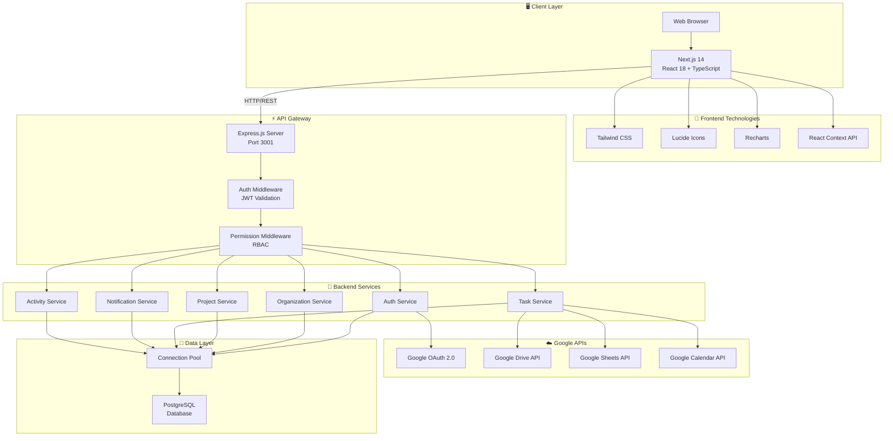
```mermaid
graph TB
    subgraph CLIENT["🖥️ Client Layer"]
        Browser["Web Browser"]
        NextJS["Next.js 14<br/>React 18 + TypeScript"]
    end

    subgraph FRONTEND["🎨 Frontend Technologies"]
        Tailwind["Tailwind CSS"]
        Lucide["Lucide Icons"]
        Recharts["Recharts"]
        Context["React Context API"]
    end

    subgraph API["⚡ API Gateway"]
        Express["Express.js Server<br/>Port 3001"]
        AuthMW["Auth Middleware<br/>JWT Validation"]
        PermMW["Permission Middleware<br/>RBAC"]
    end

    subgraph SERVICES["🔧 Backend Services"]
        AuthSvc["Auth Service"]
        OrgSvc["Organization Service"]
        ProjectSvc["Project Service"]
        TaskSvc["Task Service"]
        NotifSvc["Notification Service"]
        ActivitySvc["Activity Service"]
    end

    subgraph GOOGLE["☁️ Google APIs"]
        OAuth["Google OAuth 2.0"]
        Drive["Google Drive API"]
        Sheets["Google Sheets API"]
        Calendar["Google Calendar API"]
    end

    subgraph DATA["💾 Data Layer"]
        Postgres["PostgreSQL<br/>Database"]
        Pool["Connection Pool"]
    end

    Browser --> NextJS
    NextJS --> Tailwind
    NextJS --> Lucide
    NextJS --> Recharts
    NextJS --> Context

    NextJS -->|"HTTP/REST"| Express
    Express --> AuthMW
    AuthMW --> PermMW
    
    PermMW --> AuthSvc
    PermMW --> OrgSvc
    PermMW --> ProjectSvc
    PermMW --> TaskSvc
    PermMW --> NotifSvc
    PermMW --> ActivitySvc

    AuthSvc --> OAuth
    TaskSvc --> Drive
    TaskSvc --> Sheets
    TaskSvc --> Calendar

    AuthSvc --> Pool
    OrgSvc --> Pool
    ProjectSvc --> Pool
    TaskSvc --> Pool
    NotifSvc --> Pool
    ActivitySvc --> Pool
    Pool --> Postgres
```

---

## Module 1: Authentication & User Management

### 1.1 User Login via Google OAuth - Sequence Diagram

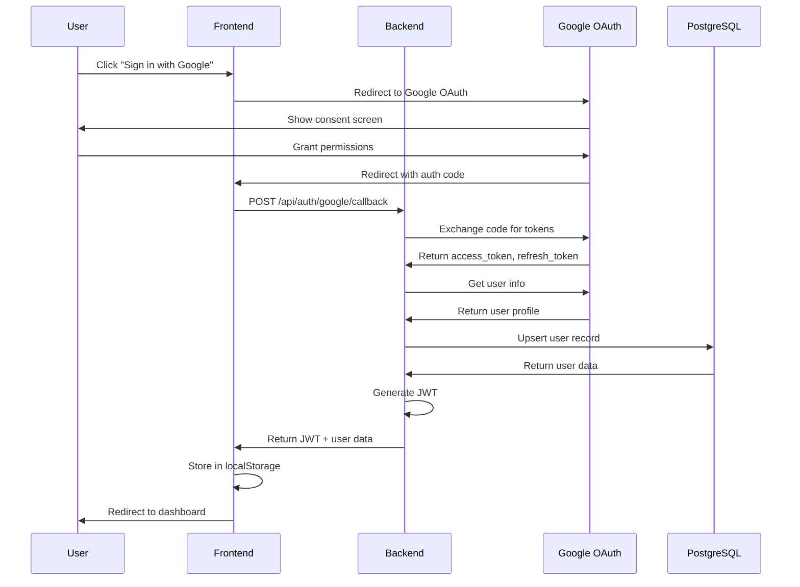
```mermaid
sequenceDiagram
    participant U as User
    participant F as Frontend
    participant B as Backend
    participant G as Google OAuth
    participant DB as PostgreSQL

    U->>F: Click "Sign in with Google"
    F->>G: Redirect to Google OAuth
    G->>U: Show consent screen
    U->>G: Grant permissions
    G->>F: Redirect with auth code
    F->>B: POST /api/auth/google/callback
    B->>G: Exchange code for tokens
    G->>B: Return access_token, refresh_token
    B->>G: Get user info
    G->>B: Return user profile
    B->>DB: Upsert user record
    DB->>B: Return user data
    B->>B: Generate JWT
    B->>F: Return JWT + user data
    F->>F: Store in localStorage
    F->>U: Redirect to dashboard
```

### 1.1 User Login via Google OAuth - Class Diagram

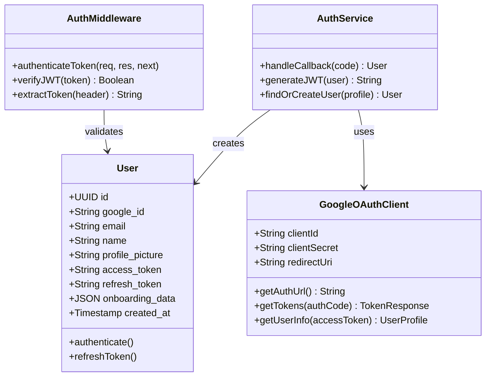
```mermaid
classDiagram
    class User {
        +UUID id
        +String google_id
        +String email
        +String name
        +String profile_picture
        +String access_token
        +String refresh_token
        +JSON onboarding_data
        +Timestamp created_at
        +authenticate()
        +refreshToken()
    }

    class AuthMiddleware {
        +authenticateToken(req, res, next)
        +verifyJWT(token) Boolean
        +extractToken(header) String
    }

    class GoogleOAuthClient {
        +String clientId
        +String clientSecret
        +String redirectUri
        +getAuthUrl() String
        +getTokens(authCode) TokenResponse
        +getUserInfo(accessToken) UserProfile
    }

    class AuthService {
        +handleCallback(code) User
        +generateJWT(user) String
        +findOrCreateUser(profile) User
    }

    AuthMiddleware --> User : validates
    AuthService --> GoogleOAuthClient : uses
    AuthService --> User : creates
```

---

### 1.2 User Onboarding - Sequence Diagram

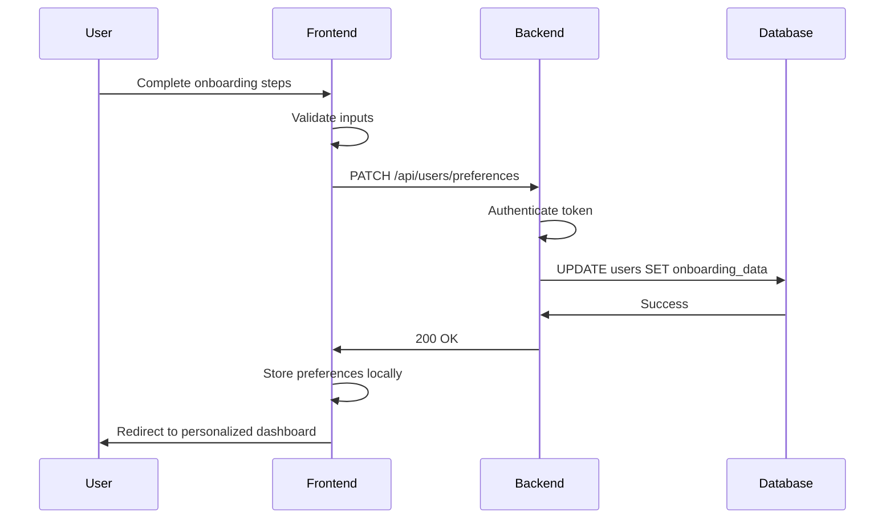
```mermaid
sequenceDiagram
    participant U as User
    participant F as Frontend
    participant B as Backend
    participant DB as Database

    U->>F: Complete onboarding steps
    F->>F: Validate inputs
    F->>B: PATCH /api/users/preferences
    B->>B: Authenticate token
    B->>DB: UPDATE users SET onboarding_data
    DB->>B: Success
    B->>F: 200 OK
    F->>F: Store preferences locally
    F->>U: Redirect to personalized dashboard
```

### 1.2 User Onboarding - Class Diagram

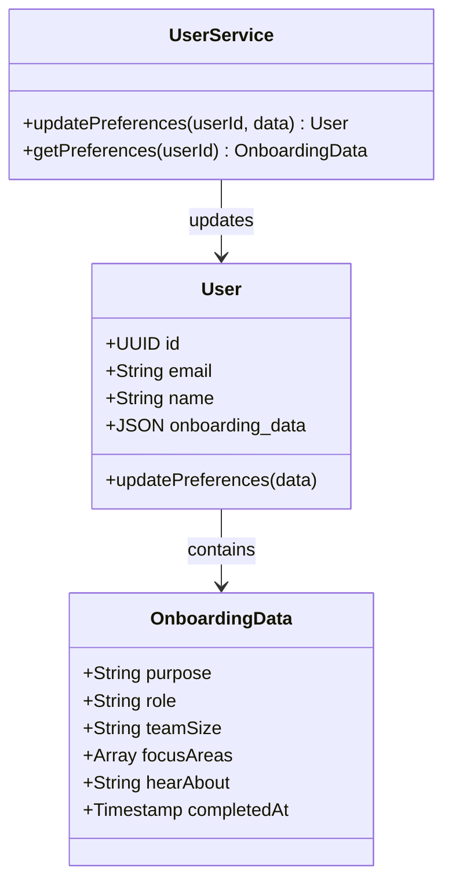
```mermaid
classDiagram
    class User {
        +UUID id
        +String email
        +String name
        +JSON onboarding_data
        +updatePreferences(data)
    }

    class OnboardingData {
        +String purpose
        +String role
        +String teamSize
        +Array focusAreas
        +String hearAbout
        +Timestamp completedAt
    }

    class UserService {
        +updatePreferences(userId, data) User
        +getPreferences(userId) OnboardingData
    }

    User --> OnboardingData : contains
    UserService --> User : updates
```

---

## Module 2: Organization & Team Management

### 2.1 Create Organization - Sequence Diagram

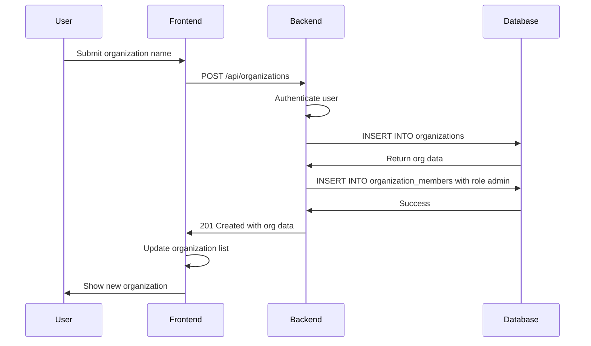
```mermaid
sequenceDiagram
    participant U as User
    participant F as Frontend
    participant B as Backend
    participant DB as Database

    U->>F: Submit organization name
    F->>B: POST /api/organizations
    B->>B: Authenticate user
    B->>DB: INSERT INTO organizations
    DB->>B: Return org data
    B->>DB: INSERT INTO organization_members with role admin
    DB->>B: Success
    B->>F: 201 Created with org data
    F->>F: Update organization list
    F->>U: Show new organization
```

### 2.1 Create Organization - Class Diagram

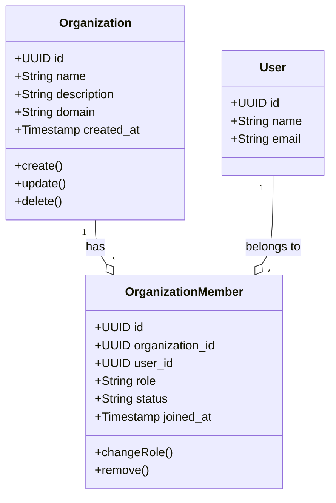
```mermaid
classDiagram
    class Organization {
        +UUID id
        +String name
        +String description
        +String domain
        +Timestamp created_at
        +create()
        +update()
        +delete()
    }

    class OrganizationMember {
        +UUID id
        +UUID organization_id
        +UUID user_id
        +String role
        +String status
        +Timestamp joined_at
        +changeRole()
        +remove()
    }

    class User {
        +UUID id
        +String name
        +String email
    }

    Organization "1" --o "*" OrganizationMember : has
    User "1" --o "*" OrganizationMember : belongs to
```

---

### 2.2 Manage Team Roles - Sequence Diagram

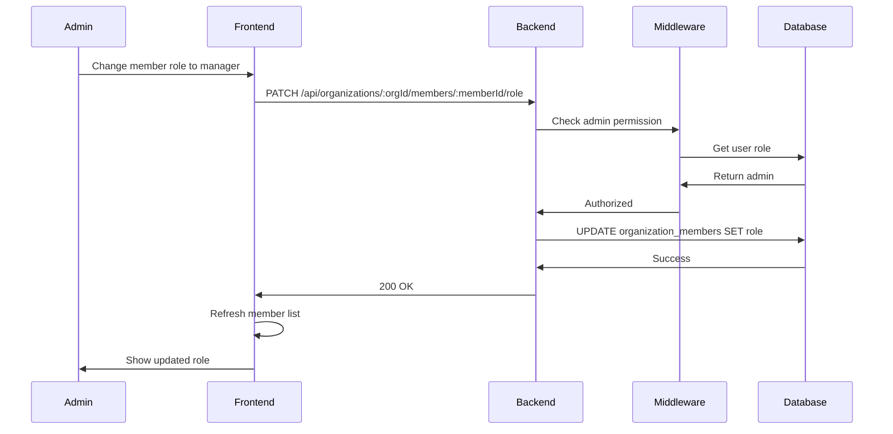
```mermaid
sequenceDiagram
    participant A as Admin
    participant F as Frontend
    participant B as Backend
    participant M as Middleware
    participant DB as Database

    A->>F: Change member role to manager
    F->>B: PATCH /api/organizations/:orgId/members/:memberId/role
    B->>M: Check admin permission
    M->>DB: Get user role
    DB->>M: Return admin
    M->>B: Authorized
    B->>DB: UPDATE organization_members SET role
    DB->>B: Success
    B->>F: 200 OK
    F->>F: Refresh member list
    F->>A: Show updated role
```

### 2.2 Manage Team Roles - Class Diagram

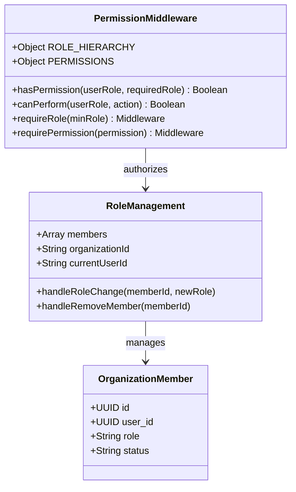
```mermaid
classDiagram
    class PermissionMiddleware {
        +Object ROLE_HIERARCHY
        +Object PERMISSIONS
        +hasPermission(userRole, requiredRole) Boolean
        +canPerform(userRole, action) Boolean
        +requireRole(minRole) Middleware
        +requirePermission(permission) Middleware
    }

    class RoleManagement {
        +Array members
        +String organizationId
        +String currentUserId
        +handleRoleChange(memberId, newRole)
        +handleRemoveMember(memberId)
    }

    class OrganizationMember {
        +UUID id
        +UUID user_id
        +String role
        +String status
    }

    PermissionMiddleware --> RoleManagement : authorizes
    RoleManagement --> OrganizationMember : manages
```

---

## Module 3: Project Management

### 3.1 Create Project - Sequence Diagram

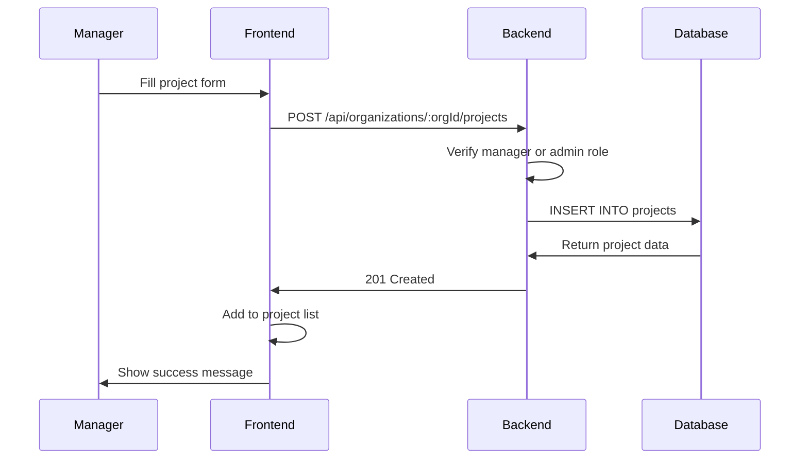
```mermaid
sequenceDiagram
    participant M as Manager
    participant F as Frontend
    participant B as Backend
    participant DB as Database

    M->>F: Fill project form
    F->>B: POST /api/organizations/:orgId/projects
    B->>B: Verify manager or admin role
    B->>DB: INSERT INTO projects
    DB->>B: Return project data
    B->>F: 201 Created
    F->>F: Add to project list
    F->>M: Show success message
```

### 3.1 Create Project - Class Diagram

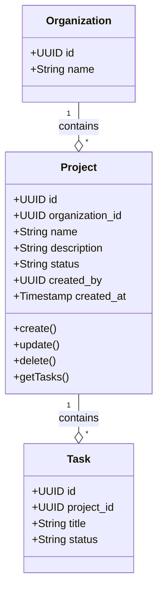
```mermaid
classDiagram
    class Project {
        +UUID id
        +UUID organization_id
        +String name
        +String description
        +String status
        +UUID created_by
        +Timestamp created_at
        +create()
        +update()
        +delete()
        +getTasks()
    }

    class Organization {
        +UUID id
        +String name
    }

    class Task {
        +UUID id
        +UUID project_id
        +String title
        +String status
    }

    Organization "1" --o "*" Project : contains
    Project "1" --o "*" Task : contains
```

---

### 3.2 View Project Dashboard - Sequence Diagram

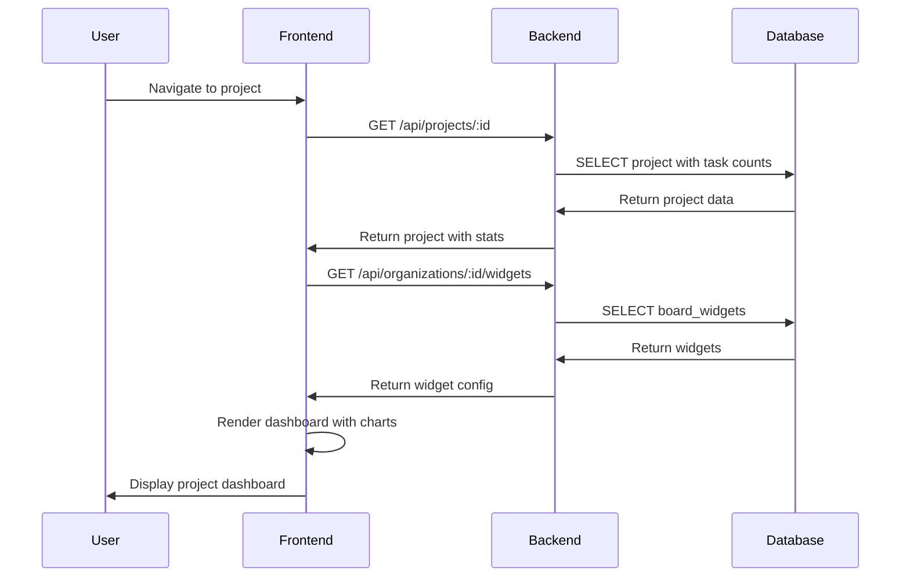
```mermaid
sequenceDiagram
    participant U as User
    participant F as Frontend
    participant B as Backend
    participant DB as Database

    U->>F: Navigate to project
    F->>B: GET /api/projects/:id
    B->>DB: SELECT project with task counts
    DB->>B: Return project data
    B->>F: Return project with stats
    F->>B: GET /api/organizations/:id/widgets
    B->>DB: SELECT board_widgets
    DB->>B: Return widgets
    B->>F: Return widget config
    F->>F: Render dashboard with charts
    F->>U: Display project dashboard
```

### 3.2 View Project Dashboard - Class Diagram

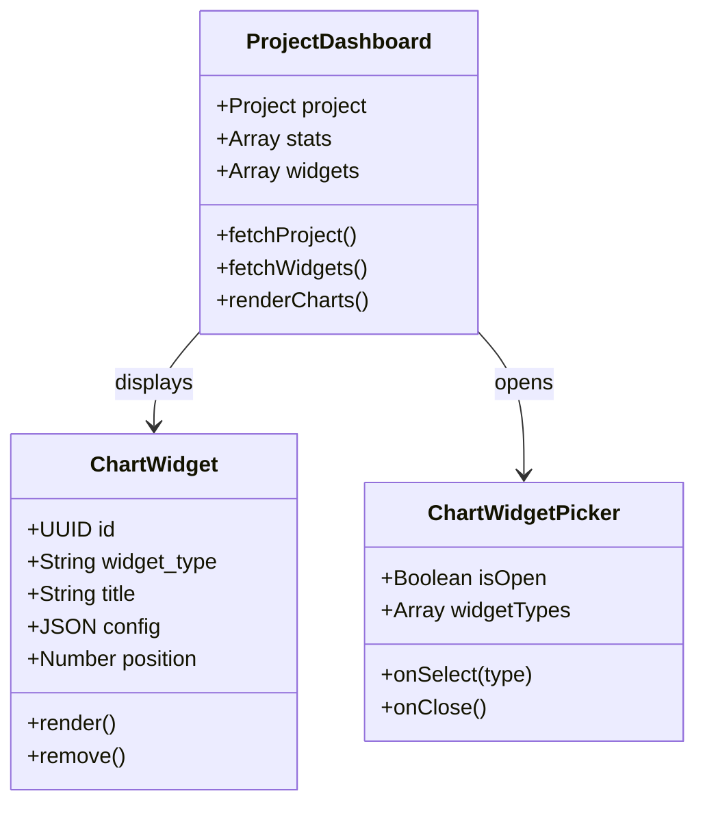
```mermaid
classDiagram
    class ProjectDashboard {
        +Project project
        +Array stats
        +Array widgets
        +fetchProject()
        +fetchWidgets()
        +renderCharts()
    }

    class ChartWidget {
        +UUID id
        +String widget_type
        +String title
        +JSON config
        +Number position
        +render()
        +remove()
    }

    class ChartWidgetPicker {
        +Boolean isOpen
        +Array widgetTypes
        +onSelect(type)
        +onClose()
    }

    ProjectDashboard --> ChartWidget : displays
    ProjectDashboard --> ChartWidgetPicker : opens
```

---

## Module 4: Task Management

### 4.1 Create Task - Sequence Diagram

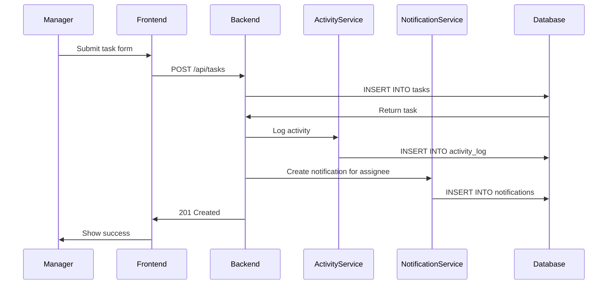
```mermaid
sequenceDiagram
    participant M as Manager
    participant F as Frontend
    participant B as Backend
    participant AS as ActivityService
    participant NS as NotificationService
    participant DB as Database

    M->>F: Submit task form
    F->>B: POST /api/tasks
    B->>DB: INSERT INTO tasks
    DB->>B: Return task
    B->>AS: Log activity
    AS->>DB: INSERT INTO activity_log
    B->>NS: Create notification for assignee
    NS->>DB: INSERT INTO notifications
    B->>F: 201 Created
    F->>M: Show success
```

### 4.1 Create Task - Class Diagram

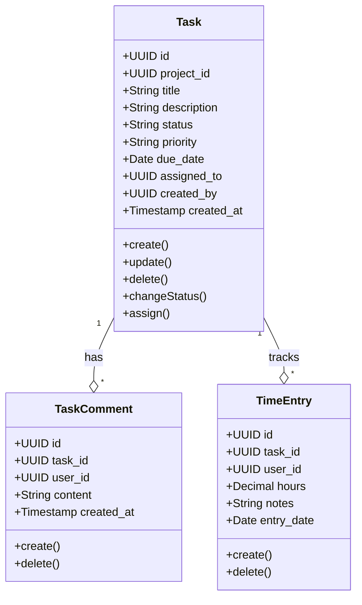
```mermaid
classDiagram
    class Task {
        +UUID id
        +UUID project_id
        +String title
        +String description
        +String status
        +String priority
        +Date due_date
        +UUID assigned_to
        +UUID created_by
        +Timestamp created_at
        +create()
        +update()
        +delete()
        +changeStatus()
        +assign()
    }

    class TaskComment {
        +UUID id
        +UUID task_id
        +UUID user_id
        +String content
        +Timestamp created_at
        +create()
        +delete()
    }

    class TimeEntry {
        +UUID id
        +UUID task_id
        +UUID user_id
        +Decimal hours
        +String notes
        +Date entry_date
        +create()
        +delete()
    }

    Task "1" --o "*" TaskComment : has
    Task "1" --o "*" TimeEntry : tracks
```

---

### 4.2 Update Task Status (Kanban) - Sequence Diagram

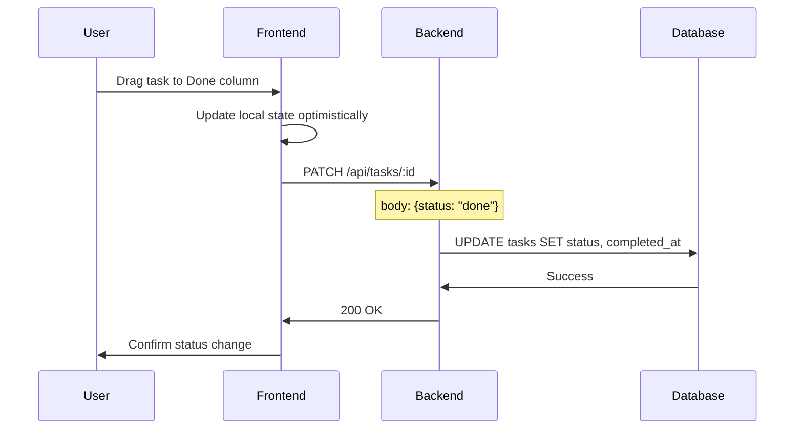
```mermaid
sequenceDiagram
    participant U as User
    participant F as Frontend
    participant B as Backend
    participant DB as Database

    U->>F: Drag task to Done column
    F->>F: Update local state optimistically
    F->>B: PATCH /api/tasks/:id
    Note over B: body: {status: "done"}
    B->>DB: UPDATE tasks SET status, completed_at
    DB->>B: Success
    B->>F: 200 OK
    F->>U: Confirm status change
```

### 4.2 Update Task Status (Kanban) - Class Diagram

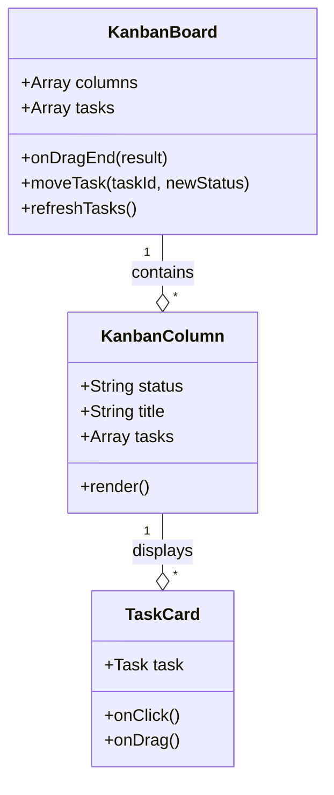
```mermaid
classDiagram
    class KanbanBoard {
        +Array columns
        +Array tasks
        +onDragEnd(result)
        +moveTask(taskId, newStatus)
        +refreshTasks()
    }

    class KanbanColumn {
        +String status
        +String title
        +Array tasks
        +render()
    }

    class TaskCard {
        +Task task
        +onClick()
        +onDrag()
    }

    KanbanBoard "1" --o "*" KanbanColumn : contains
    KanbanColumn "1" --o "*" TaskCard : displays
```

---

## Module 5: Google Workspace Integration

### 5.1 Access Google Drive - Sequence Diagram

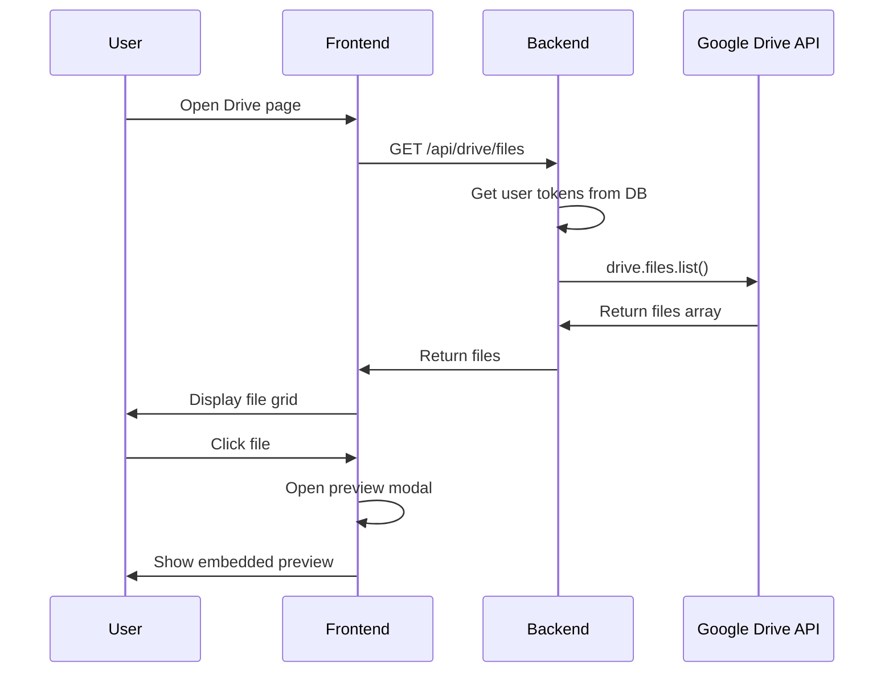
```mermaid
sequenceDiagram
    participant U as User
    participant F as Frontend
    participant B as Backend
    participant G as Google Drive API

    U->>F: Open Drive page
    F->>B: GET /api/drive/files
    B->>B: Get user tokens from DB
    B->>G: drive.files.list()
    G->>B: Return files array
    B->>F: Return files
    F->>U: Display file grid
    U->>F: Click file
    F->>F: Open preview modal
    F->>U: Show embedded preview
```

### 5.1 Access Google Drive - Class Diagram

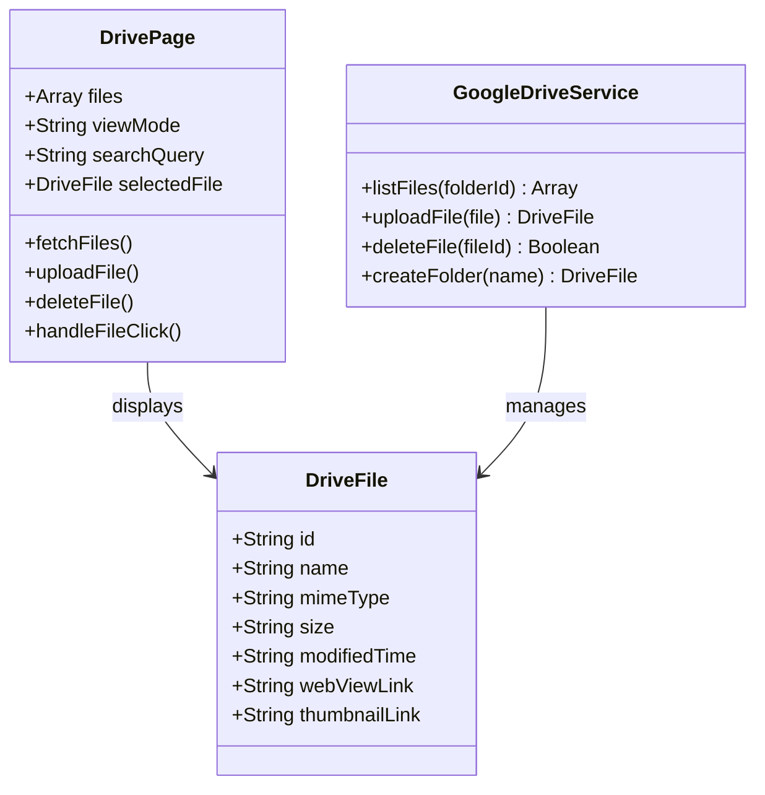
```mermaid
classDiagram
    class DrivePage {
        +Array files
        +String viewMode
        +String searchQuery
        +DriveFile selectedFile
        +fetchFiles()
        +uploadFile()
        +deleteFile()
        +handleFileClick()
    }

    class DriveFile {
        +String id
        +String name
        +String mimeType
        +String size
        +String modifiedTime
        +String webViewLink
        +String thumbnailLink
    }

    class GoogleDriveService {
        +listFiles(folderId) Array
        +uploadFile(file) DriveFile
        +deleteFile(fileId) Boolean
        +createFolder(name) DriveFile
    }

    DrivePage --> DriveFile : displays
    GoogleDriveService --> DriveFile : manages
```

---

### 5.2 Create Google Sheet - Sequence Diagram

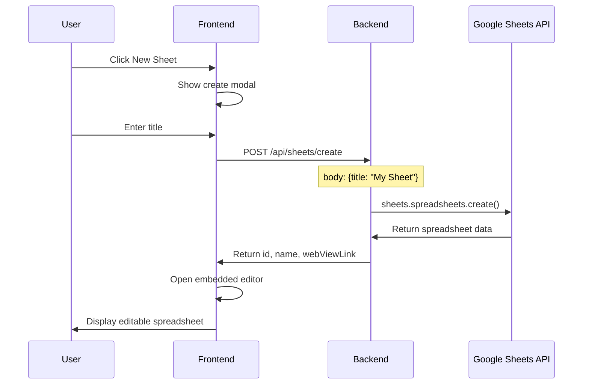
```mermaid
sequenceDiagram
    participant U as User
    participant F as Frontend
    participant B as Backend
    participant G as Google Sheets API

    U->>F: Click New Sheet
    F->>F: Show create modal
    U->>F: Enter title
    F->>B: POST /api/sheets/create
    Note over B: body: {title: "My Sheet"}
    B->>G: sheets.spreadsheets.create()
    G->>B: Return spreadsheet data
    B->>F: Return id, name, webViewLink
    F->>F: Open embedded editor
    F->>U: Display editable spreadsheet
```

### 5.2 Create Google Sheet - Class Diagram

```mermaid
classDiagram
    class SheetsPage {
        +Array spreadsheets
        +Spreadsheet selectedSheet
        +Boolean showCreateModal
        +String newSheetTitle
        +fetchSpreadsheets()
        +createSpreadsheet()
        +deleteSpreadsheet()
        +handleSheetClick()
    }

    class Spreadsheet {
        +String id
        +String name
        +String modifiedTime
        +String webViewLink
        +Array owners
    }

    class GoogleSheetsService {
        +listSpreadsheets() Array
        +createSpreadsheet(title) Spreadsheet
        +getSpreadsheet(id) Spreadsheet
    }

    SheetsPage --> Spreadsheet : displays
    GoogleSheetsService --> Spreadsheet : creates
```

---

## Module 6: Notifications & Activity

### 6.1 View Notifications - Sequence Diagram

```mermaid
sequenceDiagram
    participant U as User
    participant F as Frontend
    participant B as Backend
    participant DB as Database

    loop Every 30 seconds
        F->>B: GET /api/notifications
        B->>DB: SELECT FROM notifications WHERE user_id AND NOT is_read
        DB->>B: Return notifications
        B->>F: Return notifications array
        F->>F: Update bell badge count
    end

    U->>F: Click notification bell
    F->>U: Show dropdown
    U->>F: Click notification
    F->>B: PATCH /api/notifications/:id/read
    B->>DB: UPDATE notifications SET is_read = true
    DB->>B: Success
    B->>F: 200 OK
    F->>U: Navigate to related item
```

### 6.1 View Notifications - Class Diagram

```mermaid
classDiagram
    class NotificationBell {
        +Array notifications
        +Number unreadCount
        +Boolean isOpen
        +fetchNotifications()
        +markAsRead(id)
        +markAllAsRead()
        +handleClick(notification)
    }

    class Notification {
        +UUID id
        +UUID user_id
        +String type
        +String title
        +String message
        +Boolean is_read
        +UUID related_task_id
        +Timestamp created_at
    }

    class NotificationService {
        +create(userId, type, title, message) Notification
        +markAsRead(notificationId) Boolean
        +markAllAsRead(userId) Boolean
        +getUnreadCount(userId) Number
    }

    NotificationBell --> Notification : displays
    NotificationService --> Notification : creates
```

---

### 6.2 Activity Feed - Sequence Diagram

```mermaid
sequenceDiagram
    participant U as User
    participant F as Frontend
    participant B as Backend
    participant DB as Database

    U->>F: Open dashboard or activity view
    F->>B: GET /api/organizations/:id/activity
    B->>DB: SELECT FROM activity_log ORDER BY created_at DESC LIMIT 50
    DB->>B: Return activity records
    B->>F: Return activity array
    F->>F: Render activity feed with icons
    F->>U: Display recent activities
```

### 6.2 Activity Feed - Class Diagram

```mermaid
classDiagram
    class ActivityFeed {
        +Array activities
        +Boolean loading
        +String organizationId
        +fetchActivities()
        +renderActivity(activity)
        +getActivityIcon(action)
    }

    class ActivityLog {
        +UUID id
        +UUID organization_id
        +UUID user_id
        +String action
        +String entity_type
        +UUID entity_id
        +String entity_name
        +JSON details
        +Timestamp created_at
    }

    class ActivityService {
        +log(orgId, userId, action, entity) ActivityLog
        +getByOrganization(orgId, limit) Array
    }

    ActivityFeed --> ActivityLog : displays
    ActivityService --> ActivityLog : creates
```

---

## Data Design

### ERD (Entity Relationship Diagram)

```mermaid
erDiagram
    USERS {
        uuid id PK
        string google_id UK
        string email UK
        string name
        string profile_picture
        text access_token
        text refresh_token
        jsonb onboarding_data
        string theme_mode
        timestamp created_at
    }

    ORGANIZATIONS {
        uuid id PK
        string name
        text description
        string domain
        timestamp created_at
    }

    ORGANIZATION_MEMBERS {
        uuid id PK
        uuid organization_id FK
        uuid user_id FK
        string role
        string status
        timestamp joined_at
    }

    ORGANIZATION_INVITATIONS {
        uuid id PK
        uuid organization_id FK
        string email
        string role
        string token UK
        uuid invited_by FK
        timestamp expires_at
        timestamp accepted_at
    }

    PROJECTS {
        uuid id PK
        uuid organization_id FK
        string name
        text description
        string status
        string priority
        date start_date
        date end_date
        uuid created_by FK
        timestamp created_at
    }

    TASKS {
        uuid id PK
        uuid project_id FK
        string title
        text description
        string status
        string priority
        timestamp due_date
        uuid assigned_to FK
        uuid created_by FK
        timestamp created_at
        timestamp completed_at
    }

    TASK_ASSIGNEES {
        uuid id PK
        uuid task_id FK
        uuid user_id FK
        uuid assigned_by FK
        timestamp assigned_at
    }

    TASK_FOLLOWERS {
        uuid id PK
        uuid task_id FK
        uuid user_id FK
        timestamp followed_at
    }

    TASK_COMMENTS {
        uuid id PK
        uuid task_id FK
        uuid user_id FK
        text comment
        timestamp created_at
    }

    TIME_ENTRIES {
        uuid id PK
        uuid task_id FK
        uuid user_id FK
        decimal hours
        text notes
        date date
        timestamp created_at
    }

    NOTIFICATIONS {
        uuid id PK
        uuid user_id FK
        string type
        string title
        text message
        boolean is_read
        uuid task_id FK
        timestamp created_at
    }

    ACTIVITY_LOG {
        uuid id PK
        uuid organization_id FK
        uuid user_id FK
        string action
        string entity_type
        uuid entity_id
        string entity_name
        jsonb details
        timestamp created_at
    }

    BOARD_WIDGETS {
        uuid id PK
        uuid organization_id FK
        string widget_type
        string title
        jsonb config
        int position
        uuid created_by FK
    }

    USERS ||--o{ ORGANIZATION_MEMBERS : belongs_to
    ORGANIZATIONS ||--o{ ORGANIZATION_MEMBERS : has
    ORGANIZATIONS ||--o{ ORGANIZATION_INVITATIONS : sends
    ORGANIZATIONS ||--o{ PROJECTS : contains
    ORGANIZATIONS ||--o{ ACTIVITY_LOG : logs
    ORGANIZATIONS ||--o{ BOARD_WIDGETS : displays
    PROJECTS ||--o{ TASKS : contains
    USERS ||--o{ TASKS : assigned_to
    USERS ||--o{ TASKS : created_by
    TASKS ||--o{ TASK_ASSIGNEES : has
    TASKS ||--o{ TASK_FOLLOWERS : followed_by
    TASKS ||--o{ TASK_COMMENTS : has
    TASKS ||--o{ TIME_ENTRIES : tracks
    USERS ||--o{ NOTIFICATIONS : receives
    USERS ||--o{ TASK_COMMENTS : writes
    USERS ||--o{ TIME_ENTRIES : logs
```

---

## User Interface Design

### UI Flow Diagram

```mermaid
graph LR
    subgraph PUBLIC["Public Pages"]
        Landing["Landing Page"]
        Auth["Auth Callback"]
    end

    subgraph ONBOARD["Onboarding"]
        Welcome["Welcome Step"]
        Role["Role Selection"]
        Setup["Team Setup"]
    end

    subgraph MAIN["Main Application"]
        Dashboard["Dashboard"]
        Tasks["Tasks Page"]
        Projects["Projects Page"]
        Team["Team Page"]
        Boards["Team Boards"]
        Drive["Google Drive"]
        Sheets["Google Sheets"]
        Calendar["Calendar"]
        Settings["Settings"]
    end

    Landing -->|"Sign In"| Auth
    Auth -->|"New User"| Welcome
    Auth -->|"Existing User"| Dashboard
    Welcome --> Role --> Setup --> Dashboard
    
    Dashboard <--> Tasks
    Dashboard <--> Projects
    Dashboard <--> Team
    Dashboard <--> Boards
    Dashboard <--> Drive
    Dashboard <--> Sheets
    Dashboard <--> Calendar
    Dashboard <--> Settings
```

---

## Front-end Components

### Layout Components

| Component Name | Description & Purpose | Type/Format |
|----------------|----------------------|-------------|
| **AppLayout** | Main application wrapper with header, sidebar, and content area. Manages theme, organization switching, and user session. | Layout Component (TSX) |
| **Header** | Top navigation bar with logo, organization selector, search, theme toggle, notifications, and user menu. | Header Component (TSX) |
| **Sidebar** | Left navigation with collapsible menu items for Dashboard, Tasks, Projects, Team, Boards, Drive, Sheets, Calendar, Settings. | Navigation Component (TSX) |
| **Portal** | React Portal wrapper for rendering modals and dropdowns outside DOM hierarchy to avoid z-index issues. | Utility Component (TSX) |

### Authentication Components

| Component Name | Description & Purpose | Type/Format |
|----------------|----------------------|-------------|
| **LandingPage** | Marketing landing page with animated features, hero section, and Google Sign-In button. Professional/Aviation theme support. | Page Component (TSX) |
| **OnboardingFlow** | Multi-step wizard for new user setup: purpose, role, team size, focus areas. Saves preferences to user profile. | Page Component (TSX) |
| **AuthCallback** | Handles OAuth callback, token exchange, and redirects user to dashboard or onboarding. | Page Component (TSX) |

### Dashboard Components

| Component Name | Description & Purpose | Type/Format |
|----------------|----------------------|-------------|
| **DashboardPage** | Main dashboard showing stats cards, activity feed, upcoming tasks, and quick actions. Role-based content filtering. | Page Component (TSX) |
| **StatsCard** | Reusable card displaying metric with icon, value, label, and optional trend indicator. | UI Component (TSX) |
| **ActivityFeed** | Scrollable list of recent organization activities with icons, timestamps, and user avatars. | Data Component (TSX) |
| **QuickActions** | Grid of action buttons for common tasks: create task, invite member, create project. | UI Component (TSX) |

### Task Management Components

| Component Name | Description & Purpose | Type/Format |
|----------------|----------------------|-------------|
| **AdminTaskView** | Full-featured task management for admins with Kanban board, table view, radar view, filters, and archive. | Page Component (TSX) |
| **ManagerTaskView** | Task management for managers with board/table views, create/edit capabilities. | Page Component (TSX) |
| **MemberTaskView** | Read-only task view for members showing assigned tasks with status update capability. | Page Component (TSX) |
| **ProfessionalKanban** | Drag-and-drop Kanban board with columns for Todo, In Progress, Review, Done. Horizontal scroll navigation. | Board Component (TSX) |
| **ProfessionalTaskCard** | Task card displaying title, priority, assignee, due date with status indicators. | Card Component (TSX) |
| **BoardingPassCard** | Aviation-themed task card styled like an airline boarding pass. | Card Component (TSX) |
| **CloudGroup** | Aviation-themed Kanban column with cloud styling and status animations. | Column Component (TSX) |
| **ControlTower** | Radar-style visualization showing tasks by priority and due date proximity. | Visualization Component (TSX) |
| **TaskTimeline** | Right panel showing task comments, activity history, and time tracking with inline commenting. | Panel Component (TSX) |
| **MultiAssigneeSelect** | Multi-select dropdown for assigning multiple users to a task with add/remove API calls. | Form Component (TSX) |

### Team & Organization Components

| Component Name | Description & Purpose | Type/Format |
|----------------|----------------------|-------------|
| **AdminTeamView** | Full team management with member list, role changes, invitations, and removal. View/manage all members. | Page Component (TSX) |
| **ManagerTeamView** | Team overview for managers with limited role change capabilities. | Page Component (TSX) |
| **MemberTeamView** | Read-only team directory showing member cards with contact info. | Page Component (TSX) |
| **InviteMemberModal** | Modal form for sending email invitations with role selection. | Modal Component (TSX) |
| **RoleDropdown** | Dropdown selector for changing member roles with permission checking. | Form Component (TSX) |

### Team Board Components

| Component Name | Description & Purpose | Type/Format |
|----------------|----------------------|-------------|
| **ProfessionalTeamBoard** | Table-style team task board with inline assignee dropdown, status selector, and task management. | Board Component (TSX) |
| **FlightManifest** | Aviation-themed team board styled like airport departure board with flight numbers and gates. | Board Component (TSX) |

### Project Components

| Component Name | Description & Purpose | Type/Format |
|----------------|----------------------|-------------|
| **ProjectList** | Grid/list view of organization projects with create button and filters. | List Component (TSX) |
| **ProjectCard** | Project card showing name, status, task count, and progress indicator. | Card Component (TSX) |
| **ProjectDetails** | Project detail page with tasks, members, timeline, and settings. | Page Component (TSX) |

### Google Integration Components

| Component Name | Description & Purpose | Type/Format |
|----------------|----------------------|-------------|
| **DrivePage** | Google Drive file browser with grid/list views, folder navigation, upload, and file preview modal. | Page Component (TSX) |
| **SheetsPage** | Google Sheets manager with embedded spreadsheet editor and create/delete functionality. | Page Component (TSX) |
| **CalendarPage** | Google Calendar integration showing events in month/week/day views. | Page Component (TSX) |

### Widget Components

| Component Name | Description & Purpose | Type/Format |
|----------------|----------------------|-------------|
| **ChartWidget** | Configurable chart widget supporting bar, pie, line, and area charts using Recharts. | Chart Component (TSX) |
| **ChartWidgetPicker** | Modal for selecting widget type when adding new dashboard charts. | Picker Component (TSX) |

### Notification Components

| Component Name | Description & Purpose | Type/Format |
|----------------|----------------------|-------------|
| **NotificationBell** | Header bell icon with unread count badge, dropdown list, and mark-as-read actions. | UI Component (TSX) |
| **NotificationItem** | Individual notification row with icon, message, timestamp, and click-to-navigate. | Item Component (TSX) |

### Utility Components

| Component Name | Description & Purpose | Type/Format |
|----------------|----------------------|-------------|
| **ThemeContext** | React Context providing theme mode (professional/aviation) with localStorage persistence. | Context Provider (TSX) |
| **LoadingSpinner** | Centered loading indicator with optional message text. | UI Component (TSX) |
| **Modal** | Reusable modal wrapper with backdrop, close button, and configurable width. | UI Component (TSX) |
| **ConfirmDialog** | Confirmation modal for destructive actions with cancel/confirm buttons. | Dialog Component (TSX) |

---

## Back-end Components

### API Routes

| Component Name | Description & Purpose | Type/Format |
|----------------|----------------------|-------------|
| **auth.routes.ts** | Authentication endpoints: Google OAuth callback, token refresh, logout, get current user. | Express Router |
| **user.routes.ts** | User profile management: get profile, update preferences, change theme mode. | Express Router |
| **organization.routes.ts** | Organization CRUD, member management, role changes, invitation handling. | Express Router |
| **task.routes.ts** | Task CRUD, status updates, assignment, comments, time entries, following. | Express Router |
| **project.routes.ts** | Project CRUD, member assignment, project statistics. | Express Router |
| **notification.routes.ts** | Get notifications, mark as read, mark all as read, delete notification. | Express Router |
| **invitation.routes.ts** | Validate invitation tokens, accept invitations, cancel invitations. | Express Router |
| **widget.routes.ts** | Dashboard widget CRUD for charts and analytics. | Express Router |
| **drive.routes.ts** | Google Drive proxy: list files, upload, download, create folders. | Express Router |
| **sheets.routes.ts** | Google Sheets proxy: list spreadsheets, create, get data, update cells. | Express Router |
| **calendar.routes.ts** | Google Calendar proxy: list events, create event, update event. | Express Router |
| **timeEntry.routes.ts** | Time tracking: log hours, list entries, delete entries under tasks. | Express Router |

### Middleware

| Component Name | Description & Purpose | Type/Format |
|----------------|----------------------|-------------|
| **auth.middleware.ts** | JWT token validation, user extraction from token, request augmentation with user data. | Express Middleware |
| **permission.middleware.ts** | Role-based access control (RBAC), permission checking, role hierarchy enforcement. | Express Middleware |

### Services

| Component Name | Description & Purpose | Type/Format |
|----------------|----------------------|-------------|
| **notification.service.ts** | Create notifications, send assignment alerts, comment notifications, mark as read. | Service Class |
| **activity.service.ts** | Log user activities, track entity changes, generate activity feed data. | Service Class |
| **migration.service.ts** | Database schema management, automatic migrations, version tracking. | Service Class |

### Configuration

| Component Name | Description & Purpose | Type/Format |
|----------------|----------------------|-------------|
| **database.ts** | PostgreSQL connection pool configuration, query wrapper with logging. | Config Module |
| **google.ts** | Google OAuth2 client setup, Drive/Sheets/Calendar API client initialization. | Config Module |
| **logger.ts** | Winston logger configuration with console and file transports. | Config Module |

### Database Schema (Migrations)

| Migration | Description & Purpose | Type/Format |
|-----------|----------------------|-------------|
| **001_add_personal_flag** | Add is_personal flag to organizations for personal workspace detection. | SQL Migration |
| **002_add_onboarding_data** | Add onboarding_data JSON field to users table. | SQL Migration |
| **003_add_organization_invitations** | Create organization invitations table for email invites. | SQL Migration |
| **004_add_board_widgets** | Create board_widgets table for dashboard charts. | SQL Migration |
| **005_add_activity_entity_name** | Add entity_name field to activity_log for display. | SQL Migration |
| **006_add_time_entries** | Create time_entries table for time tracking. | SQL Migration |
| **007_add_task_comments** | Create task_comments table for task discussions. | SQL Migration |
| **008_add_theme_mode** | Add theme_mode preference field to users. | SQL Migration |
| **009_add_task_followers** | Create task_followers junction table for task subscriptions. | SQL Migration |
| **010_add_notification_task_id** | Add task_id foreign key to notifications for task linking. | SQL Migration |
| **011_task_assignees** | Create task_assignees junction table for multi-assignee support. | SQL Migration |

---

## Object-Oriented Components Summary

The system follows object-oriented design principles:

### Domain Models
- **User**: Core entity representing authenticated users with profile and preferences
- **Organization**: Workspace container with members and role-based access
- **Project**: Grouping of tasks within an organization
- **Task**: Primary work item with status, priority, assignments, and comments
- **Notification**: User alerts for assignments, comments, and updates

### Service Layer
- **AuthService**: Handles OAuth flow and JWT generation
- **NotificationService**: Creates and delivers user notifications
- **ActivityService**: Logs user actions for audit trail
- **MigrationService**: Manages database schema evolution

### Access Control
- **AuthMiddleware**: Validates JWT tokens on protected routes
- **PermissionMiddleware**: Enforces role-based permissions (Admin > Manager > Member)

### Integration Adapters
- **GoogleDriveAdapter**: Proxies requests to Google Drive API
- **GoogleSheetsAdapter**: Proxies requests to Google Sheets API
- **GoogleCalendarAdapter**: Proxies requests to Google Calendar API

