# SkyFlow - Mermaid Diagram Codes

Copy each code block into [mermaid.live](https://mermaid.live) and export as PNG/SVG.

---

## System Block Diagram

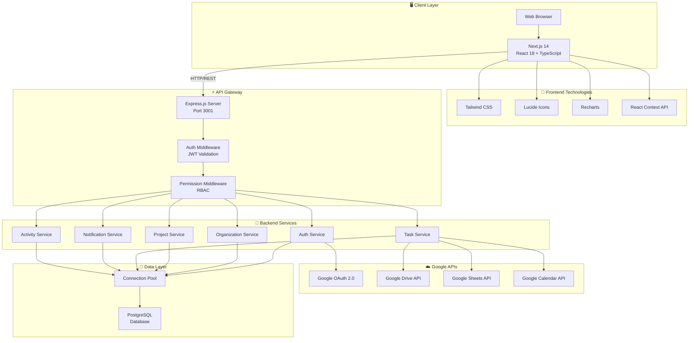
```mermaid
graph TB
    subgraph CLIENT["🖥️ Client Layer"]
        Browser["Web Browser"]
        NextJS["Next.js 14<br/>React 18 + TypeScript"]
    end

    subgraph FRONTEND["🎨 Frontend Technologies"]
        Tailwind["Tailwind CSS"]
        Lucide["Lucide Icons"]
        Recharts["Recharts"]
        Context["React Context API"]
    end

    subgraph API["⚡ API Gateway"]
        Express["Express.js Server<br/>Port 3001"]
        AuthMW["Auth Middleware<br/>JWT Validation"]
        PermMW["Permission Middleware<br/>RBAC"]
    end

    subgraph SERVICES["🔧 Backend Services"]
        AuthSvc["Auth Service"]
        OrgSvc["Organization Service"]
        ProjectSvc["Project Service"]
        TaskSvc["Task Service"]
        NotifSvc["Notification Service"]
        ActivitySvc["Activity Service"]
    end

    subgraph GOOGLE["☁️ Google APIs"]
        OAuth["Google OAuth 2.0"]
        Drive["Google Drive API"]
        Sheets["Google Sheets API"]
        Calendar["Google Calendar API"]
    end

    subgraph DATA["💾 Data Layer"]
        Postgres["PostgreSQL<br/>Database"]
        Pool["Connection Pool"]
    end

    Browser --> NextJS
    NextJS --> Tailwind
    NextJS --> Lucide
    NextJS --> Recharts
    NextJS --> Context

    NextJS -->|"HTTP/REST"| Express
    Express --> AuthMW
    AuthMW --> PermMW
    
    PermMW --> AuthSvc
    PermMW --> OrgSvc
    PermMW --> ProjectSvc
    PermMW --> TaskSvc
    PermMW --> NotifSvc
    PermMW --> ActivitySvc

    AuthSvc --> OAuth
    TaskSvc --> Drive
    TaskSvc --> Sheets
    TaskSvc --> Calendar

    AuthSvc --> Pool
    OrgSvc --> Pool
    ProjectSvc --> Pool
    TaskSvc --> Pool
    NotifSvc --> Pool
    ActivitySvc --> Pool
    Pool --> Postgres
```

---

# Module 1: Authentication & User Management

## 1.1 User Login via Google OAuth

### User Interface Design

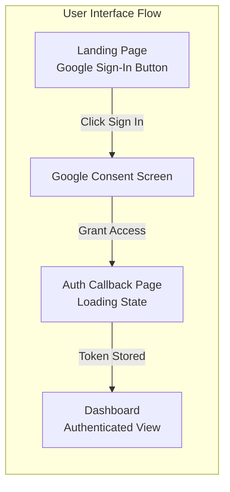
```mermaid
graph LR
    subgraph UI["User Interface Flow"]
        Landing["Landing Page<br/>Google Sign-In Button"]
        Consent["Google Consent Screen"]
        Callback["Auth Callback Page<br/>Loading State"]
        Dashboard["Dashboard<br/>Authenticated View"]
    end
    
    Landing -->|"Click Sign In"| Consent
    Consent -->|"Grant Access"| Callback
    Callback -->|"Token Stored"| Dashboard
```

### Front-end Components

| Component Name | Description & Purpose | Component Type |
|----------------|----------------------|----------------|
| **LandingPage** | Marketing page with hero section, animated features showcase, and prominent Google Sign-In button. Supports Professional/Aviation themes. | Page Component (TSX) |
| **GoogleSignInButton** | Styled button that redirects to Google OAuth consent screen. Displays Google logo and loading state. | Button Component (TSX) |
| **AuthCallback** | Handles OAuth callback URL, extracts authorization code, exchanges for tokens, stores JWT in localStorage. | Page Component (TSX) |
| **LoadingSpinner** | Displays centered spinner during authentication process with optional message. | UI Component (TSX) |

### Back-end Components

| Component Name | Description & Purpose | Component Type |
|----------------|----------------------|----------------|
| **auth.routes.ts** | Express router handling `/api/auth/google/callback` for OAuth token exchange and JWT generation. | Express Router |
| **auth.middleware.ts** | JWT validation middleware that extracts user from token and attaches to request object. | Express Middleware |
| **google.ts** | Google OAuth2 client configuration with client ID, secret, and redirect URI. | Config Module |

### Object-Oriented Components

#### Sequence Diagram

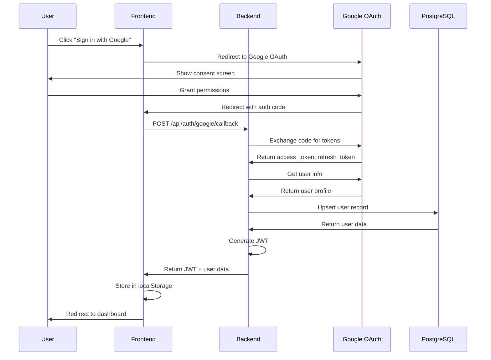
```mermaid
sequenceDiagram
    participant U as User
    participant F as Frontend
    participant B as Backend
    participant G as Google OAuth
    participant DB as PostgreSQL

    U->>F: Click "Sign in with Google"
    F->>G: Redirect to Google OAuth
    G->>U: Show consent screen
    U->>G: Grant permissions
    G->>F: Redirect with auth code
    F->>B: POST /api/auth/google/callback
    B->>G: Exchange code for tokens
    G->>B: Return access_token, refresh_token
    B->>G: Get user info
    G->>B: Return user profile
    B->>DB: Upsert user record
    DB->>B: Return user data
    B->>B: Generate JWT
    B->>F: Return JWT + user data
    F->>F: Store in localStorage
    F->>U: Redirect to dashboard
```

#### Class Diagram

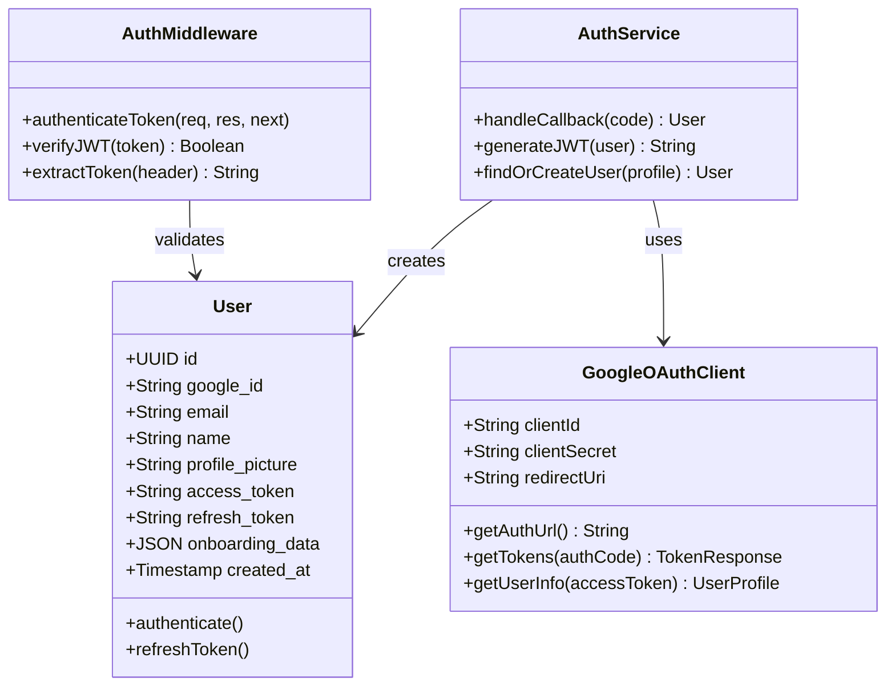
```mermaid
classDiagram
    class User {
        +UUID id
        +String google_id
        +String email
        +String name
        +String profile_picture
        +String access_token
        +String refresh_token
        +JSON onboarding_data
        +Timestamp created_at
        +authenticate()
        +refreshToken()
    }

    class AuthMiddleware {
        +authenticateToken(req, res, next)
        +verifyJWT(token) Boolean
        +extractToken(header) String
    }

    class GoogleOAuthClient {
        +String clientId
        +String clientSecret
        +String redirectUri
        +getAuthUrl() String
        +getTokens(authCode) TokenResponse
        +getUserInfo(accessToken) UserProfile
    }

    class AuthService {
        +handleCallback(code) User
        +generateJWT(user) String
        +findOrCreateUser(profile) User
    }

    AuthMiddleware --> User : validates
    AuthService --> GoogleOAuthClient : uses
    AuthService --> User : creates
```

### Data Design (ERD)

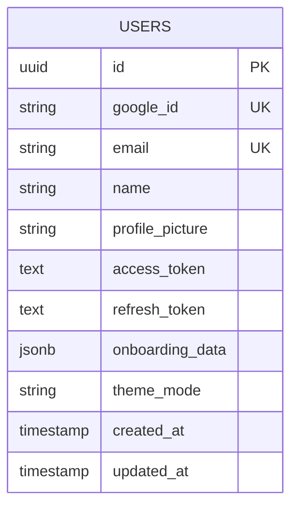
```mermaid
erDiagram
    USERS {
        uuid id PK
        string google_id UK
        string email UK
        string name
        string profile_picture
        text access_token
        text refresh_token
        jsonb onboarding_data
        string theme_mode
        timestamp created_at
        timestamp updated_at
    }
```

---

## 1.2 User Onboarding

### User Interface Design

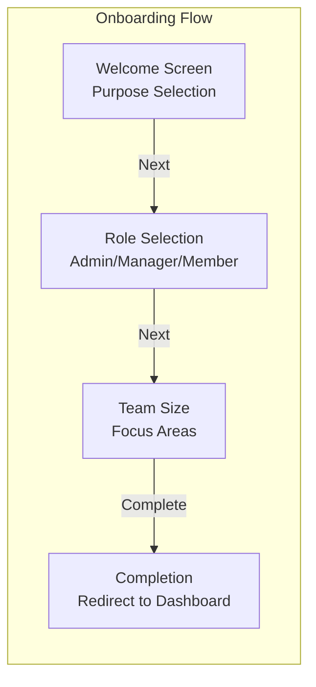
```mermaid
graph LR
    subgraph ONBOARD["Onboarding Flow"]
        Welcome["Welcome Screen<br/>Purpose Selection"]
        Role["Role Selection<br/>Admin/Manager/Member"]
        Team["Team Size<br/>Focus Areas"]
        Complete["Completion<br/>Redirect to Dashboard"]
    end
    
    Welcome -->|"Next"| Role
    Role -->|"Next"| Team
    Team -->|"Complete"| Complete
```

### Front-end Components

| Component Name | Description & Purpose | Component Type |
|----------------|----------------------|----------------|
| **OnboardingFlow** | Multi-step wizard component managing onboarding state with step indicators and navigation. | Page Component (TSX) |
| **StepPurpose** | First onboarding step where user selects their primary purpose (Work, School, Personal). | Step Component (TSX) |
| **StepRole** | Role selection step for choosing organizational role preference. | Step Component (TSX) |
| **StepTeamSize** | Team configuration step with size selection and focus area checkboxes. | Step Component (TSX) |
| **StepIndicator** | Visual progress indicator showing current step and completed steps. | UI Component (TSX) |

### Back-end Components

| Component Name | Description & Purpose | Component Type |
|----------------|----------------------|----------------|
| **user.routes.ts** | Express router with `PATCH /api/users/preferences` endpoint for saving onboarding data. | Express Router |

### Object-Oriented Components

#### Sequence Diagram

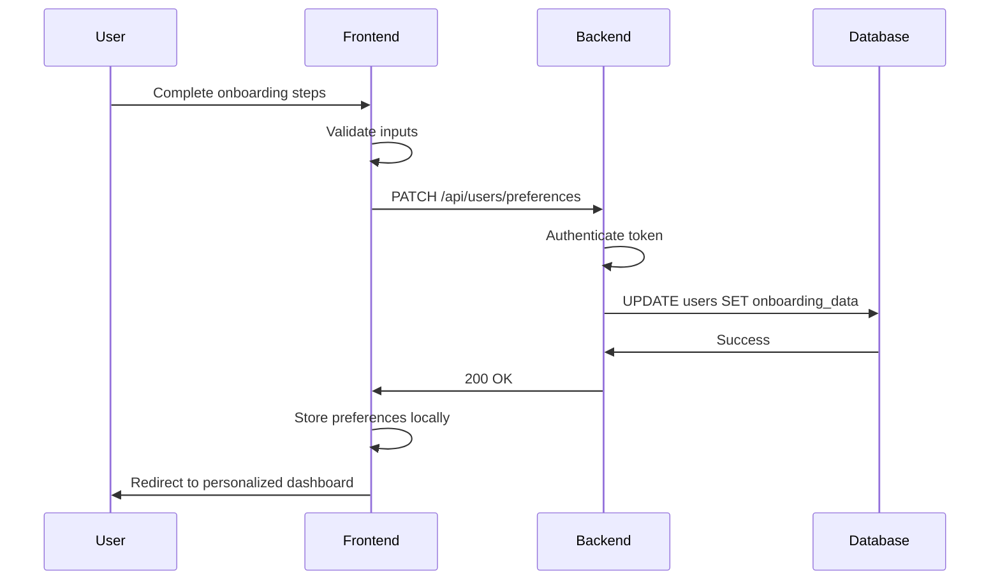
```mermaid
sequenceDiagram
    participant U as User
    participant F as Frontend
    participant B as Backend
    participant DB as Database

    U->>F: Complete onboarding steps
    F->>F: Validate inputs
    F->>B: PATCH /api/users/preferences
    B->>B: Authenticate token
    B->>DB: UPDATE users SET onboarding_data
    DB->>B: Success
    B->>F: 200 OK
    F->>F: Store preferences locally
    F->>U: Redirect to personalized dashboard
```

#### Class Diagram

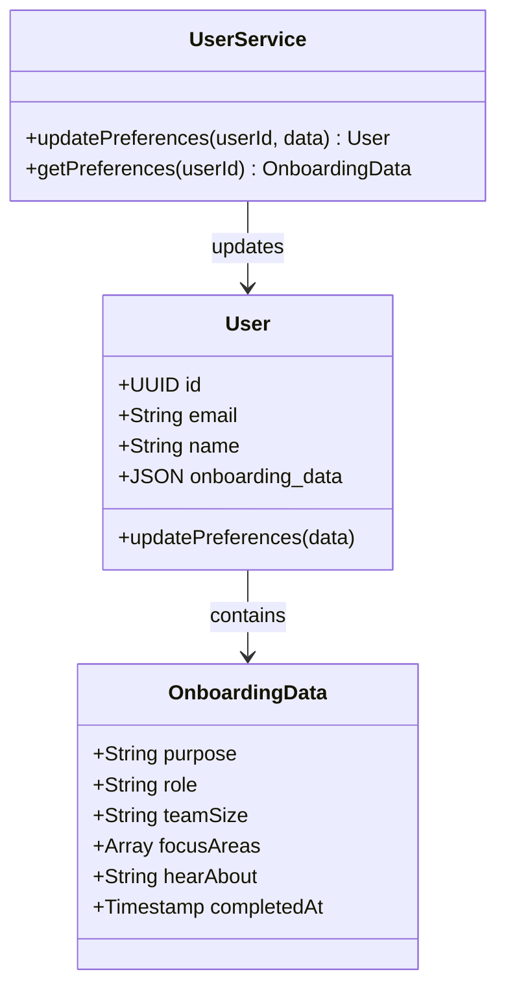
```mermaid
classDiagram
    class User {
        +UUID id
        +String email
        +String name
        +JSON onboarding_data
        +updatePreferences(data)
    }

    class OnboardingData {
        +String purpose
        +String role
        +String teamSize
        +Array focusAreas
        +String hearAbout
        +Timestamp completedAt
    }

    class UserService {
        +updatePreferences(userId, data) User
        +getPreferences(userId) OnboardingData
    }

    User --> OnboardingData : contains
    UserService --> User : updates
```

### Data Design (ERD)

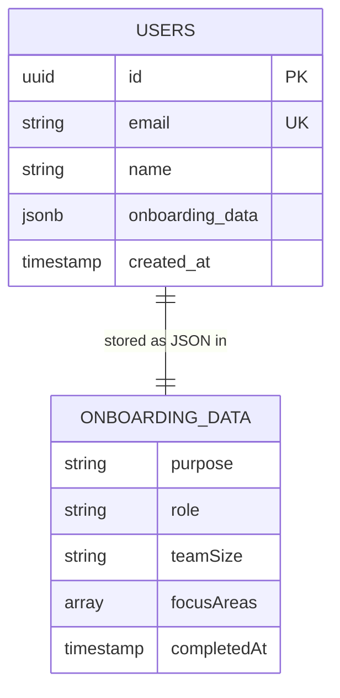
```mermaid
erDiagram
    USERS {
        uuid id PK
        string email UK
        string name
        jsonb onboarding_data
        timestamp created_at
    }
    
    ONBOARDING_DATA {
        string purpose
        string role
        string teamSize
        array focusAreas
        timestamp completedAt
    }
    
    USERS ||--|| ONBOARDING_DATA : "stored as JSON in"
```

---

# Module 2: Organization & Team Management

## 2.1 Create Organization

### User Interface Design

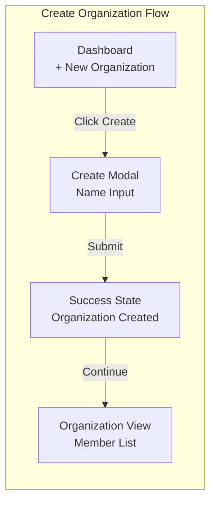
```mermaid
graph LR
    subgraph UI["Create Organization Flow"]
        Dashboard["Dashboard<br/>+ New Organization"]
        Modal["Create Modal<br/>Name Input"]
        Success["Success State<br/>Organization Created"]
        OrgView["Organization View<br/>Member List"]
    end
    
    Dashboard -->|"Click Create"| Modal
    Modal -->|"Submit"| Success
    Success -->|"Continue"| OrgView
```

### Front-end Components

| Component Name | Description & Purpose | Component Type |
|----------------|----------------------|----------------|
| **CreateOrganizationModal** | Modal dialog with form for entering organization name and optional description. | Modal Component (TSX) |
| **OrganizationSelector** | Header dropdown for switching between organizations the user belongs to. | Dropdown Component (TSX) |
| **OrganizationCard** | Card displaying organization info with member count and quick actions. | Card Component (TSX) |

### Back-end Components

| Component Name | Description & Purpose | Component Type |
|----------------|----------------------|----------------|
| **organization.routes.ts** | Express router with `POST /api/organizations` for creating new organizations. | Express Router |

### Object-Oriented Components

#### Sequence Diagram

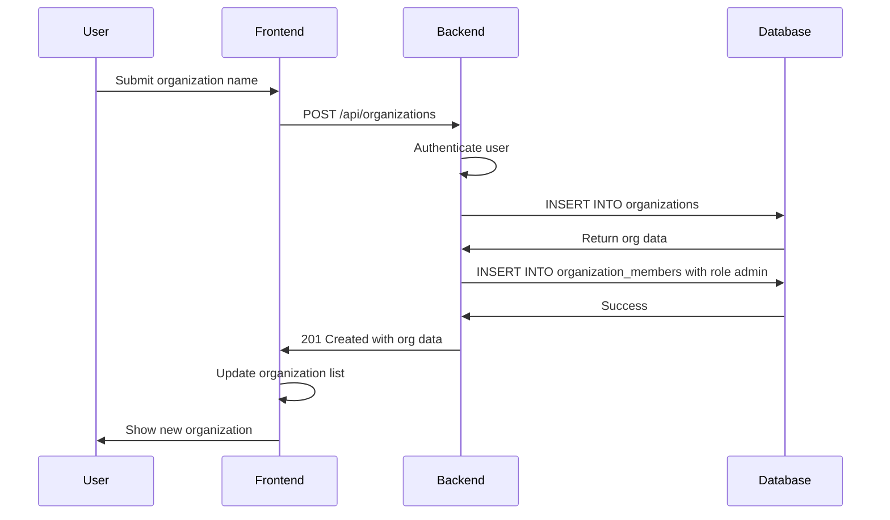
```mermaid
sequenceDiagram
    participant U as User
    participant F as Frontend
    participant B as Backend
    participant DB as Database

    U->>F: Submit organization name
    F->>B: POST /api/organizations
    B->>B: Authenticate user
    B->>DB: INSERT INTO organizations
    DB->>B: Return org data
    B->>DB: INSERT INTO organization_members with role admin
    DB->>B: Success
    B->>F: 201 Created with org data
    F->>F: Update organization list
    F->>U: Show new organization
```

#### Class Diagram

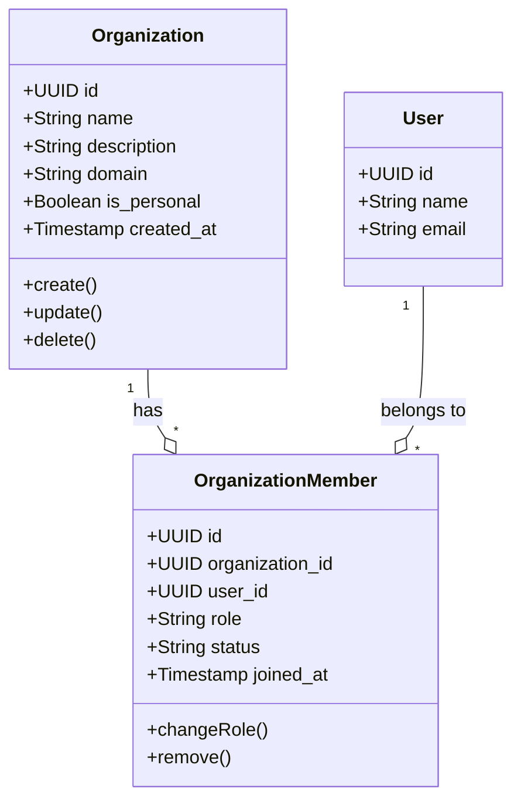
```mermaid
classDiagram
    class Organization {
        +UUID id
        +String name
        +String description
        +String domain
        +Boolean is_personal
        +Timestamp created_at
        +create()
        +update()
        +delete()
    }

    class OrganizationMember {
        +UUID id
        +UUID organization_id
        +UUID user_id
        +String role
        +String status
        +Timestamp joined_at
        +changeRole()
        +remove()
    }

    class User {
        +UUID id
        +String name
        +String email
    }

    Organization "1" --o "*" OrganizationMember : has
    User "1" --o "*" OrganizationMember : belongs to
```

### Data Design (ERD)

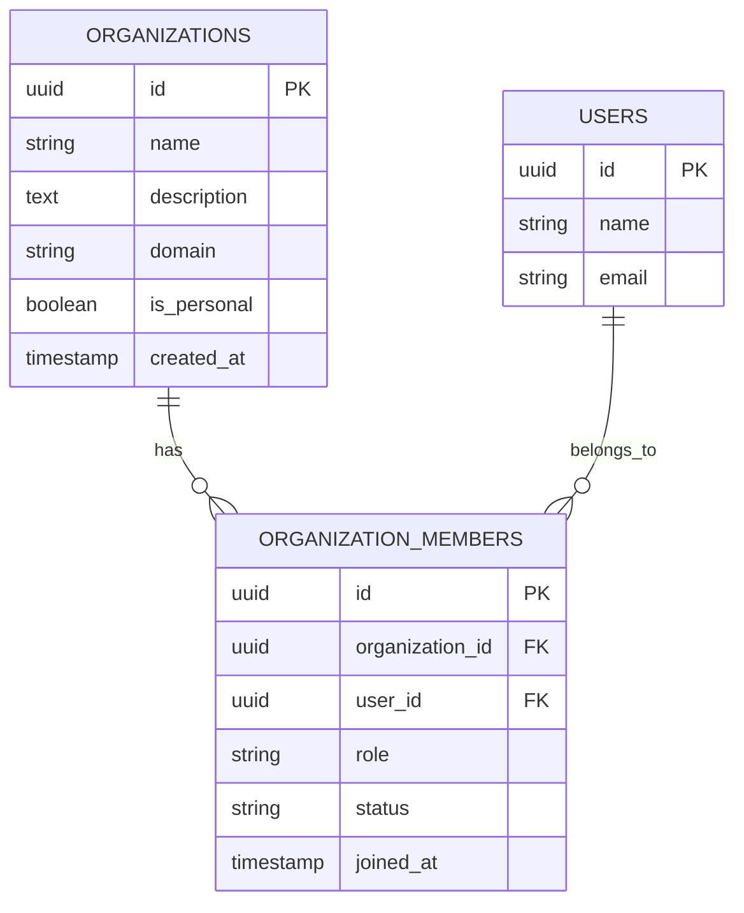
```mermaid
erDiagram
    ORGANIZATIONS {
        uuid id PK
        string name
        text description
        string domain
        boolean is_personal
        timestamp created_at
    }

    ORGANIZATION_MEMBERS {
        uuid id PK
        uuid organization_id FK
        uuid user_id FK
        string role
        string status
        timestamp joined_at
    }

    USERS {
        uuid id PK
        string name
        string email
    }

    ORGANIZATIONS ||--o{ ORGANIZATION_MEMBERS : has
    USERS ||--o{ ORGANIZATION_MEMBERS : belongs_to
```

---

## 2.2 Manage Team Roles

### User Interface Design

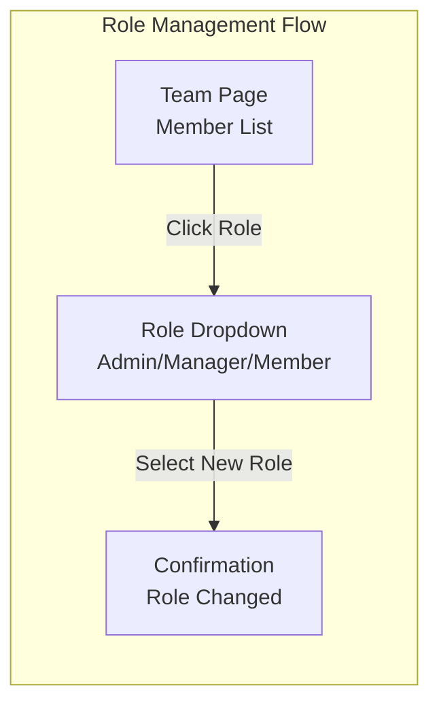
```mermaid
graph LR
    subgraph UI["Role Management Flow"]
        Team["Team Page<br/>Member List"]
        Dropdown["Role Dropdown<br/>Admin/Manager/Member"]
        Confirm["Confirmation<br/>Role Changed"]
    end
    
    Team -->|"Click Role"| Dropdown
    Dropdown -->|"Select New Role"| Confirm
```

### Front-end Components

| Component Name | Description & Purpose | Component Type |
|----------------|----------------------|----------------|
| **AdminTeamView** | Full team management page for admins with member list, role dropdowns, invite button, and remove action. | Page Component (TSX) |
| **ManagerTeamView** | Team view for managers with limited role change capabilities (can only change to member). | Page Component (TSX) |
| **MemberTeamView** | Read-only team directory showing member cards with contact info. | Page Component (TSX) |
| **RoleDropdown** | Dropdown selector with role options filtered by current user's permissions. | Form Component (TSX) |
| **MemberCard** | Card displaying member avatar, name, email, role badge, and action buttons. | Card Component (TSX) |

### Back-end Components

| Component Name | Description & Purpose | Component Type |
|----------------|----------------------|----------------|
| **organization.routes.ts** | `PATCH /api/organizations/:orgId/members/:memberId/role` endpoint for role changes. | Express Router |
| **permission.middleware.ts** | RBAC middleware enforcing role hierarchy (Admin > Manager > Member). | Express Middleware |

### Object-Oriented Components

#### Sequence Diagram

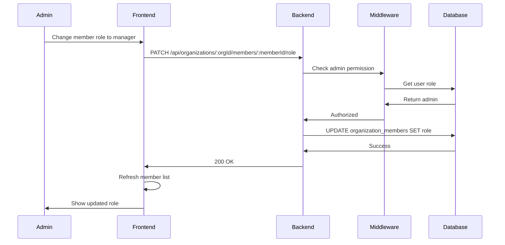
```mermaid
sequenceDiagram
    participant A as Admin
    participant F as Frontend
    participant B as Backend
    participant M as Middleware
    participant DB as Database

    A->>F: Change member role to manager
    F->>B: PATCH /api/organizations/:orgId/members/:memberId/role
    B->>M: Check admin permission
    M->>DB: Get user role
    DB->>M: Return admin
    M->>B: Authorized
    B->>DB: UPDATE organization_members SET role
    DB->>B: Success
    B->>F: 200 OK
    F->>F: Refresh member list
    F->>A: Show updated role
```

#### Class Diagram

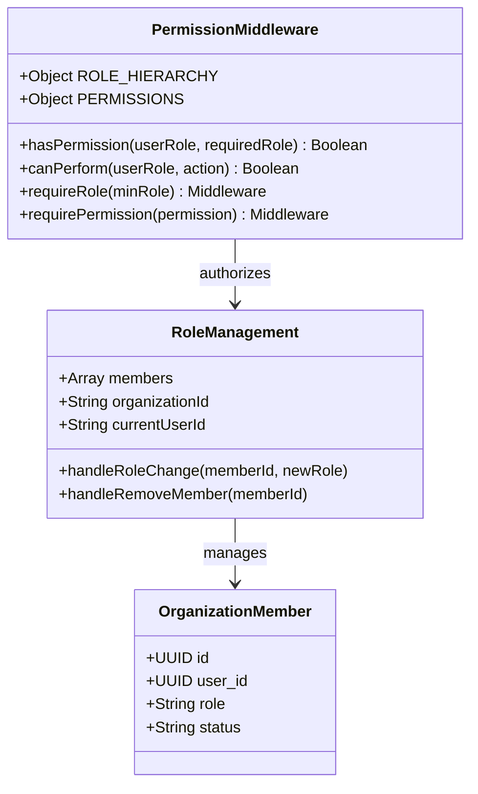
```mermaid
classDiagram
    class PermissionMiddleware {
        +Object ROLE_HIERARCHY
        +Object PERMISSIONS
        +hasPermission(userRole, requiredRole) Boolean
        +canPerform(userRole, action) Boolean
        +requireRole(minRole) Middleware
        +requirePermission(permission) Middleware
    }

    class RoleManagement {
        +Array members
        +String organizationId
        +String currentUserId
        +handleRoleChange(memberId, newRole)
        +handleRemoveMember(memberId)
    }

    class OrganizationMember {
        +UUID id
        +UUID user_id
        +String role
        +String status
    }

    PermissionMiddleware --> RoleManagement : authorizes
    RoleManagement --> OrganizationMember : manages
```

### Data Design (ERD)

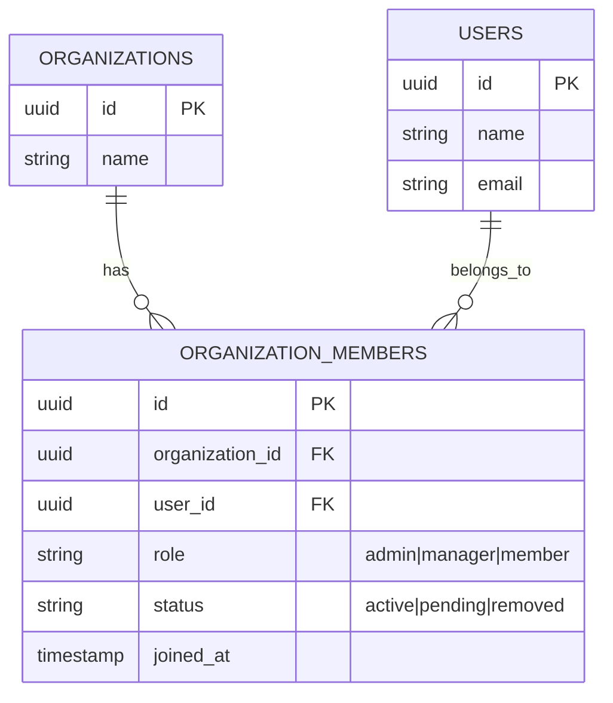
```mermaid
erDiagram
    ORGANIZATION_MEMBERS {
        uuid id PK
        uuid organization_id FK
        uuid user_id FK
        string role "admin|manager|member"
        string status "active|pending|removed"
        timestamp joined_at
    }

    ORGANIZATIONS {
        uuid id PK
        string name
    }

    USERS {
        uuid id PK
        string name
        string email
    }

    ORGANIZATIONS ||--o{ ORGANIZATION_MEMBERS : has
    USERS ||--o{ ORGANIZATION_MEMBERS : belongs_to
```

---

## 2.3 Invite Team Members

### User Interface Design

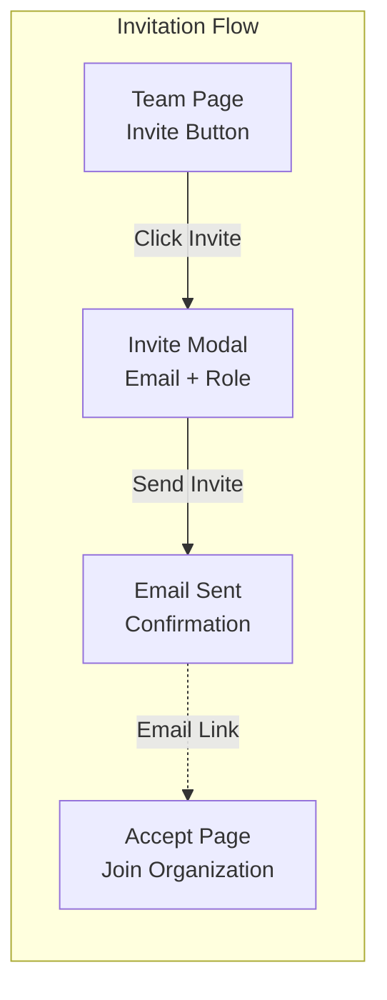
```mermaid
graph LR
    subgraph UI["Invitation Flow"]
        Team["Team Page<br/>Invite Button"]
        Modal["Invite Modal<br/>Email + Role"]
        Sent["Email Sent<br/>Confirmation"]
        Accept["Accept Page<br/>Join Organization"]
    end
    
    Team -->|"Click Invite"| Modal
    Modal -->|"Send Invite"| Sent
    Sent -.->|"Email Link"| Accept
```

### Front-end Components

| Component Name | Description & Purpose | Component Type |
|----------------|----------------------|----------------|
| **InviteMemberModal** | Modal with email input, role selector, and send button. Validates email format. | Modal Component (TSX) |
| **PendingInvitesList** | List of pending invitations with resend and cancel actions. | List Component (TSX) |
| **AcceptInvitePage** | Public page for accepting invitation via token link. | Page Component (TSX) |

### Back-end Components

| Component Name | Description & Purpose | Component Type |
|----------------|----------------------|----------------|
| **organization.routes.ts** | `POST /api/organizations/:orgId/invitations` for sending invites. | Express Router |
| **invitation.routes.ts** | `GET /api/invitations/validate` and `POST /api/invitations/accept` for invitation handling. | Express Router |

### Object-Oriented Components

#### Sequence Diagram

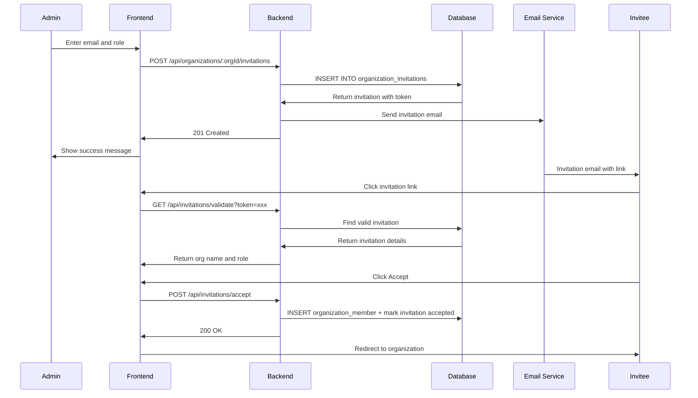
```mermaid
sequenceDiagram
    participant A as Admin
    participant F as Frontend
    participant B as Backend
    participant DB as Database
    participant E as Email Service
    participant I as Invitee

    A->>F: Enter email and role
    F->>B: POST /api/organizations/:orgId/invitations
    B->>DB: INSERT INTO organization_invitations
    DB->>B: Return invitation with token
    B->>E: Send invitation email
    B->>F: 201 Created
    F->>A: Show success message
    E->>I: Invitation email with link
    I->>F: Click invitation link
    F->>B: GET /api/invitations/validate?token=xxx
    B->>DB: Find valid invitation
    DB->>B: Return invitation details
    B->>F: Return org name and role
    I->>F: Click Accept
    F->>B: POST /api/invitations/accept
    B->>DB: INSERT organization_member + mark invitation accepted
    B->>F: 200 OK
    F->>I: Redirect to organization
```

#### Class Diagram

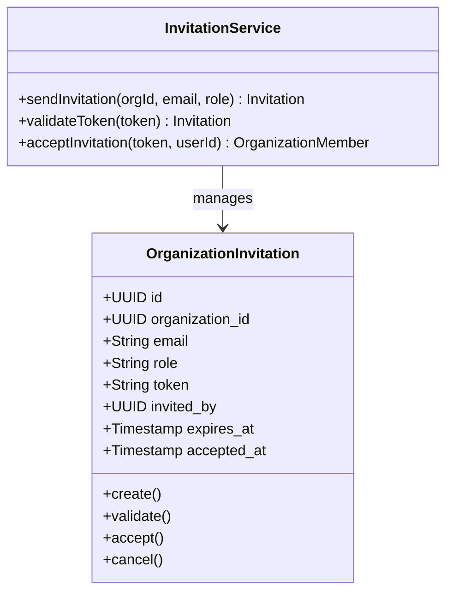
```mermaid
classDiagram
    class OrganizationInvitation {
        +UUID id
        +UUID organization_id
        +String email
        +String role
        +String token
        +UUID invited_by
        +Timestamp expires_at
        +Timestamp accepted_at
        +create()
        +validate()
        +accept()
        +cancel()
    }

    class InvitationService {
        +sendInvitation(orgId, email, role) Invitation
        +validateToken(token) Invitation
        +acceptInvitation(token, userId) OrganizationMember
    }

    InvitationService --> OrganizationInvitation : manages
```

### Data Design (ERD)

```mermaid
erDiagram
    ORGANIZATION_INVITATIONS {
        uuid id PK
        uuid organization_id FK
        string email
        string role
        string token UK
        uuid invited_by FK
        timestamp expires_at
        timestamp accepted_at
        timestamp created_at
    }

    ORGANIZATIONS {
        uuid id PK
        string name
    }

    USERS {
        uuid id PK
        string email
    }

    ORGANIZATIONS ||--o{ ORGANIZATION_INVITATIONS : sends
    USERS ||--o{ ORGANIZATION_INVITATIONS : invited_by
```

---

# Module 3: Project Management

## 3.1 Create Project

### User Interface Design

```mermaid
graph LR
    subgraph UI["Create Project Flow"]
        Projects["Projects Page<br/>+ New Project"]
        Modal["Create Modal<br/>Name, Description, Dates"]
        Success["Project Created<br/>Redirect to Details"]
    end
    
    Projects -->|"Click Create"| Modal
    Modal -->|"Submit"| Success
```

### Front-end Components

| Component Name | Description & Purpose | Component Type |
|----------------|----------------------|----------------|
| **ProjectList** | Grid/list view of organization projects with create button, search, and status filters. | Page Component (TSX) |
| **CreateProjectModal** | Modal form with name, description, priority, start/end date inputs. | Modal Component (TSX) |
| **ProjectCard** | Card showing project name, status badge, task count, and progress bar. | Card Component (TSX) |

### Back-end Components

| Component Name | Description & Purpose | Component Type |
|----------------|----------------------|----------------|
| **project.routes.ts** | Express router with `POST /api/organizations/:orgId/projects` for project creation. | Express Router |

### Object-Oriented Components

#### Sequence Diagram

```mermaid
sequenceDiagram
    participant M as Manager
    participant F as Frontend
    participant B as Backend
    participant DB as Database

    M->>F: Fill project form
    F->>B: POST /api/organizations/:orgId/projects
    B->>B: Verify manager or admin role
    B->>DB: INSERT INTO projects
    DB->>B: Return project data
    B->>F: 201 Created
    F->>F: Add to project list
    F->>M: Show success message
```

#### Class Diagram

```mermaid
classDiagram
    class Project {
        +UUID id
        +UUID organization_id
        +String name
        +String description
        +String status
        +String priority
        +Date start_date
        +Date end_date
        +UUID created_by
        +Timestamp created_at
        +create()
        +update()
        +delete()
        +getTasks()
    }

    class Organization {
        +UUID id
        +String name
    }

    class Task {
        +UUID id
        +UUID project_id
        +String title
        +String status
    }

    Organization "1" --o "*" Project : contains
    Project "1" --o "*" Task : contains
```

### Data Design (ERD)

```mermaid
erDiagram
    PROJECTS {
        uuid id PK
        uuid organization_id FK
        string name
        text description
        string status "planning|active|completed|on_hold"
        string priority "low|medium|high|critical"
        date start_date
        date end_date
        decimal budget
        uuid created_by FK
        timestamp created_at
    }

    ORGANIZATIONS {
        uuid id PK
        string name
    }

    ORGANIZATIONS ||--o{ PROJECTS : contains
```

---

## 3.2 View Project Dashboard

### User Interface Design

```mermaid
graph LR
    subgraph UI["Project Dashboard"]
        Header["Project Header<br/>Name, Status, Actions"]
        Stats["Stats Cards<br/>Tasks, Progress, Members"]
        Widgets["Chart Widgets<br/>Customizable"]
        Tasks["Task List<br/>Kanban/Table View"]
    end
    
    Header --> Stats
    Stats --> Widgets
    Widgets --> Tasks
```

### Front-end Components

| Component Name | Description & Purpose | Component Type |
|----------------|----------------------|----------------|
| **ProjectDetails** | Main project page with header, stats, task board, and settings. | Page Component (TSX) |
| **ProjectStatsCards** | Row of stats cards showing task counts by status, progress percentage. | UI Component (TSX) |
| **ChartWidget** | Configurable chart (bar, pie, line) displaying project analytics using Recharts. | Chart Component (TSX) |
| **ChartWidgetPicker** | Modal for selecting and adding new chart widgets to dashboard. | Picker Component (TSX) |

### Back-end Components

| Component Name | Description & Purpose | Component Type |
|----------------|----------------------|----------------|
| **project.routes.ts** | `GET /api/projects/:id` returns project with task stats and member count. | Express Router |
| **widget.routes.ts** | CRUD endpoints for dashboard widgets at `/api/organizations/:id/widgets`. | Express Router |

### Object-Oriented Components

#### Sequence Diagram

```mermaid
sequenceDiagram
    participant U as User
    participant F as Frontend
    participant B as Backend
    participant DB as Database

    U->>F: Navigate to project
    F->>B: GET /api/projects/:id
    B->>DB: SELECT project with task counts
    DB->>B: Return project data
    B->>F: Return project with stats
    F->>B: GET /api/organizations/:id/widgets
    B->>DB: SELECT board_widgets
    DB->>B: Return widgets
    B->>F: Return widget config
    F->>F: Render dashboard with charts
    F->>U: Display project dashboard
```

#### Class Diagram

```mermaid
classDiagram
    class ProjectDashboard {
        +Project project
        +Array stats
        +Array widgets
        +fetchProject()
        +fetchWidgets()
        +renderCharts()
    }

    class ChartWidget {
        +UUID id
        +String widget_type
        +String title
        +JSON config
        +Number position
        +render()
        +remove()
    }

    class ChartWidgetPicker {
        +Boolean isOpen
        +Array widgetTypes
        +onSelect(type)
        +onClose()
    }

    ProjectDashboard --> ChartWidget : displays
    ProjectDashboard --> ChartWidgetPicker : opens
```

### Data Design (ERD)

```mermaid
erDiagram
    PROJECTS {
        uuid id PK
        uuid organization_id FK
        string name
        string status
        uuid created_by FK
    }

    BOARD_WIDGETS {
        uuid id PK
        uuid organization_id FK
        string widget_type
        string title
        jsonb config
        int position
        uuid created_by FK
        timestamp created_at
    }

    TASKS {
        uuid id PK
        uuid project_id FK
        string status
    }

    PROJECTS ||--o{ TASKS : contains
    ORGANIZATIONS ||--o{ BOARD_WIDGETS : displays
```

---

# Module 4: Task Management

## 4.1 Create Task

### User Interface Design

```mermaid
graph LR
    subgraph UI["Create Task Flow"]
        Board["Kanban Board<br/>+ Add Task Button"]
        Modal["Create Modal<br/>Title, Description, Priority"]
        Card["New Task Card<br/>In Todo Column"]
    end
    
    Board -->|"Click Add"| Modal
    Modal -->|"Submit"| Card
```

### Front-end Components

| Component Name | Description & Purpose | Component Type |
|----------------|----------------------|----------------|
| **AdminTaskView** | Full-featured task management with Kanban, table, radar views, filters, and archive. Admin-only features. | Page Component (TSX) |
| **ManagerTaskView** | Task management for managers with create/edit capabilities and board/table views. | Page Component (TSX) |
| **MemberTaskView** | Read-only task view showing assigned tasks with status update capability. | Page Component (TSX) |
| **CreateTaskModal** | Modal form with title, description, priority, due date, and assignee fields. | Modal Component (TSX) |
| **ProfessionalKanban** | Drag-and-drop Kanban board with columns for Todo, In Progress, Review, Done. Horizontal scroll. | Board Component (TSX) |
| **ProfessionalTaskCard** | Task card displaying title, priority badge, assignee avatar, due date. | Card Component (TSX) |

### Back-end Components

| Component Name | Description & Purpose | Component Type |
|----------------|----------------------|----------------|
| **task.routes.ts** | `POST /api/tasks` for creating tasks with automatic activity logging and notifications. | Express Router |
| **notification.service.ts** | Creates notifications for task assignee when assigned. | Service Class |
| **activity.service.ts** | Logs task creation in organization activity feed. | Service Class |

### Object-Oriented Components

#### Sequence Diagram

```mermaid
sequenceDiagram
    participant M as Manager
    participant F as Frontend
    participant B as Backend
    participant AS as ActivityService
    participant NS as NotificationService
    participant DB as Database

    M->>F: Submit task form
    F->>B: POST /api/tasks
    B->>DB: INSERT INTO tasks
    DB->>B: Return task
    B->>AS: Log activity
    AS->>DB: INSERT INTO activity_log
    B->>NS: Create notification for assignee
    NS->>DB: INSERT INTO notifications
    B->>F: 201 Created
    F->>M: Show success
```

#### Class Diagram

```mermaid
classDiagram
    class Task {
        +UUID id
        +UUID project_id
        +String title
        +String description
        +String status
        +String priority
        +Date due_date
        +UUID assigned_to
        +UUID created_by
        +Timestamp created_at
        +Timestamp completed_at
        +create()
        +update()
        +delete()
        +changeStatus()
        +assign()
    }

    class TaskComment {
        +UUID id
        +UUID task_id
        +UUID user_id
        +String comment
        +Timestamp created_at
        +create()
        +delete()
    }

    class TimeEntry {
        +UUID id
        +UUID task_id
        +UUID user_id
        +Decimal hours
        +String notes
        +Date date
        +create()
        +delete()
    }

    Task "1" --o "*" TaskComment : has
    Task "1" --o "*" TimeEntry : tracks
```

### Data Design (ERD)

```mermaid
erDiagram
    TASKS {
        uuid id PK
        uuid project_id FK
        string title
        text description
        string status "todo|in_progress|review|done|archived"
        string priority "low|medium|high|critical"
        timestamp due_date
        decimal estimated_hours
        decimal actual_hours
        uuid assigned_to FK
        uuid created_by FK
        timestamp created_at
        timestamp completed_at
    }

    PROJECTS {
        uuid id PK
        string name
    }

    USERS {
        uuid id PK
        string name
    }

    PROJECTS ||--o{ TASKS : contains
    USERS ||--o{ TASKS : assigned_to
    USERS ||--o{ TASKS : created_by
```

---

## 4.2 Update Task Status (Kanban)

### User Interface Design

```mermaid
graph LR
    subgraph UI["Status Change Flow"]
        Todo["Todo Column<br/>Task Card"]
        InProgress["In Progress Column<br/>Drop Target"]
        Done["Done Column<br/>Completed"]
    end
    
    Todo -->|"Drag"| InProgress
    InProgress -->|"Drag"| Done
```

### Front-end Components

| Component Name | Description & Purpose | Component Type |
|----------------|----------------------|----------------|
| **ProfessionalKanban** | Kanban board with drag-drop between columns. Optimistic UI updates. | Board Component (TSX) |
| **BoardingPassCard** | Aviation-themed task card styled like airline boarding pass for Aviation mode. | Card Component (TSX) |
| **CloudGroup** | Aviation-themed column with animated clouds for status visualization. | Column Component (TSX) |
| **ControlTower** | Radar visualization showing tasks by priority and urgency. | Visualization Component (TSX) |

### Back-end Components

| Component Name | Description & Purpose | Component Type |
|----------------|----------------------|----------------|
| **task.routes.ts** | `PATCH /api/tasks/:id` updates status, sets `completed_at` when done. | Express Router |

### Object-Oriented Components

#### Sequence Diagram

```mermaid
sequenceDiagram
    participant U as User
    participant F as Frontend
    participant B as Backend
    participant DB as Database

    U->>F: Drag task to Done column
    F->>F: Update local state optimistically
    F->>B: PATCH /api/tasks/:id
    Note over B: body: {status: "done"}
    B->>DB: UPDATE tasks SET status, completed_at
    DB->>B: Success
    B->>F: 200 OK
    F->>U: Confirm status change
```

#### Class Diagram

```mermaid
classDiagram
    class KanbanBoard {
        +Array columns
        +Array tasks
        +onDragEnd(result)
        +moveTask(taskId, newStatus)
        +refreshTasks()
    }

    class KanbanColumn {
        +String status
        +String title
        +Array tasks
        +render()
    }

    class TaskCard {
        +Task task
        +onClick()
        +onDrag()
    }

    KanbanBoard "1" --o "*" KanbanColumn : contains
    KanbanColumn "1" --o "*" TaskCard : displays
```

### Data Design (ERD)

```mermaid
erDiagram
    TASKS {
        uuid id PK
        string status "todo|in_progress|review|done"
        timestamp completed_at "Set when status=done"
        timestamp updated_at
    }
```

---

## 4.3 Task Assignment

### User Interface Design

```mermaid
graph LR
    subgraph UI["Assignment Flow"]
        Board["Team Board<br/>Task Row"]
        Dropdown["Assignee Dropdown<br/>Member List"]
        Updated["Updated View<br/>New Assignee Avatar"]
    end
    
    Board -->|"Click Assignee"| Dropdown
    Dropdown -->|"Select Member"| Updated
```

### Front-end Components

| Component Name | Description & Purpose | Component Type |
|----------------|----------------------|----------------|
| **ProfessionalTeamBoard** | Table-style board with inline assignee dropdown for each task row. | Board Component (TSX) |
| **FlightManifest** | Aviation-themed team board styled like airport departure board. | Board Component (TSX) |
| **MultiAssigneeSelect** | Multi-select dropdown for assigning multiple users to a task. | Form Component (TSX) |

### Back-end Components

| Component Name | Description & Purpose | Component Type |
|----------------|----------------------|----------------|
| **task.routes.ts** | `PATCH /api/tasks/:id` with `assigned_to` field, sends notifications. | Express Router |
| **task.routes.ts** | `POST/DELETE /api/tasks/:id/assignees/:userId` for multi-assignee support. | Express Router |
| **notification.service.ts** | `notifyTaskAssignment()` creates notification for new assignee. | Service Class |

### Object-Oriented Components

#### Sequence Diagram

```mermaid
sequenceDiagram
    participant M as Manager
    participant F as Frontend
    participant B as Backend
    participant NS as NotificationService
    participant DB as Database

    M->>F: Select assignee from dropdown
    F->>B: PATCH /api/tasks/:id {assigned_to: userId}
    B->>DB: UPDATE tasks SET assigned_to
    DB->>B: Return updated task
    B->>NS: notifyTaskAssignment(taskId, userId)
    NS->>DB: INSERT INTO notifications
    B->>DB: INSERT INTO task_followers (auto-follow)
    B->>F: 200 OK with task
    F->>F: Update task card with new assignee
    F->>M: Show updated assignment
```

#### Class Diagram

```mermaid
classDiagram
    class Task {
        +UUID id
        +UUID assigned_to
        +assign(userId)
        +unassign()
    }

    class TaskAssignee {
        +UUID id
        +UUID task_id
        +UUID user_id
        +UUID assigned_by
        +Timestamp assigned_at
    }

    class NotificationService {
        +notifyTaskAssignment(taskId, title, assigneeId, assignerName)
    }

    Task "1" --o "*" TaskAssignee : has
    NotificationService --> Task : notifies on
```

### Data Design (ERD)

```mermaid
erDiagram
    TASKS {
        uuid id PK
        uuid assigned_to FK
    }

    TASK_ASSIGNEES {
        uuid id PK
        uuid task_id FK
        uuid user_id FK
        uuid assigned_by FK
        timestamp assigned_at
    }

    TASK_FOLLOWERS {
        uuid id PK
        uuid task_id FK
        uuid user_id FK
        timestamp followed_at
    }

    USERS {
        uuid id PK
        string name
    }

    TASKS ||--o{ TASK_ASSIGNEES : has
    TASKS ||--o{ TASK_FOLLOWERS : followed_by
    USERS ||--o{ TASK_ASSIGNEES : assigned_to
    USERS ||--o{ TASK_FOLLOWERS : follows
```

---

## 4.4 Task Comments & Timeline

### User Interface Design

```mermaid
graph TB
    subgraph UI["Task Timeline Panel"]
        Task["Task Details<br/>Click to Edit"]
        Timeline["Activity Timeline<br/>Comments, Changes"]
        Input["Comment Input<br/>Add Comment"]
    end
    
    Task --> Timeline
    Timeline --> Input
    Input -->|"Submit"| Timeline
```

### Front-end Components

| Component Name | Description & Purpose | Component Type |
|----------------|----------------------|----------------|
| **TaskTimeline** | Side panel showing task history with comments, status changes, and time entries. | Panel Component (TSX) |
| **CommentInput** | Text input with submit button for adding comments to task. | Form Component (TSX) |
| **TimelineItem** | Single timeline entry showing icon, user, action, and timestamp. | Item Component (TSX) |
| **TimeLogSection** | Time tracking UI with hours input and log history. | Panel Component (TSX) |

### Back-end Components

| Component Name | Description & Purpose | Component Type |
|----------------|----------------------|----------------|
| **task.routes.ts** | `POST /api/tasks/:id/comments` for adding comments, `GET` for fetching. | Express Router |
| **timeEntry.routes.ts** | `POST /api/tasks/:taskId/time-entries` for logging time. | Express Router |

### Object-Oriented Components

#### Sequence Diagram

```mermaid
sequenceDiagram
    participant U as User
    participant F as Frontend
    participant B as Backend
    participant NS as NotificationService
    participant DB as Database

    U->>F: Type comment and submit
    F->>B: POST /api/tasks/:id/comments
    B->>DB: INSERT INTO task_comments
    DB->>B: Return comment
    B->>DB: SELECT task_followers WHERE task_id
    DB->>B: Return follower list
    B->>NS: Notify each follower
    NS->>DB: INSERT notifications for followers
    B->>F: 201 Created
    F->>F: Add comment to timeline
    F->>U: Show new comment
```

#### Class Diagram

```mermaid
classDiagram
    class TaskTimeline {
        +UUID taskId
        +Array comments
        +Array timeEntries
        +Array activities
        +fetchTimeline()
        +addComment(text)
        +logTime(hours, notes)
    }

    class TaskComment {
        +UUID id
        +UUID task_id
        +UUID user_id
        +String user_name
        +String comment
        +Timestamp created_at
    }

    class TimeEntry {
        +UUID id
        +UUID task_id
        +UUID user_id
        +Decimal hours
        +String notes
        +Date date
    }

    TaskTimeline --> TaskComment : displays
    TaskTimeline --> TimeEntry : displays
```

### Data Design (ERD)

```mermaid
erDiagram
    TASK_COMMENTS {
        uuid id PK
        uuid task_id FK
        uuid user_id FK
        text comment
        timestamp created_at
    }

    TIME_ENTRIES {
        uuid id PK
        uuid task_id FK
        uuid user_id FK
        string user_name
        decimal hours
        text notes
        date date
        timestamp created_at
    }

    TASKS {
        uuid id PK
        string title
    }

    USERS {
        uuid id PK
        string name
    }

    TASKS ||--o{ TASK_COMMENTS : has
    TASKS ||--o{ TIME_ENTRIES : tracks
    USERS ||--o{ TASK_COMMENTS : writes
    USERS ||--o{ TIME_ENTRIES : logs
```

---

# Module 5: Google Workspace Integration

## 5.1 Access Google Drive

### User Interface Design

```mermaid
graph LR
    subgraph UI["Drive Interface"]
        Sidebar["View Selector<br/>My Drive, Shared, Recent"]
        Grid["File Grid<br/>Thumbnails"]
        Preview["Preview Modal<br/>Embedded Viewer"]
    end
    
    Sidebar --> Grid
    Grid -->|"Click File"| Preview
```

### Front-end Components

| Component Name | Description & Purpose | Component Type |
|----------------|----------------------|----------------|
| **DrivePage** | Google Drive file browser with grid/list views, folder navigation, upload button. | Page Component (TSX) |
| **FileGrid** | Grid of file cards with thumbnails, names, and quick actions. | Grid Component (TSX) |
| **FilePreviewModal** | Modal with embedded Google Drive viewer for file preview. | Modal Component (TSX) |
| **ViewModeToggle** | Toggle between grid and list view modes. | UI Component (TSX) |

### Back-end Components

| Component Name | Description & Purpose | Component Type |
|----------------|----------------------|----------------|
| **drive.routes.ts** | Proxy to Google Drive API: `GET /api/drive/files`, `POST /folder`, `GET /files/:id`. | Express Router |
| **google.ts** | Configures Drive API client with user's OAuth tokens. | Config Module |

### Object-Oriented Components

#### Sequence Diagram

```mermaid
sequenceDiagram
    participant U as User
    participant F as Frontend
    participant B as Backend
    participant G as Google Drive API

    U->>F: Open Drive page
    F->>B: GET /api/drive/files
    B->>B: Get user tokens from DB
    B->>G: drive.files.list()
    G->>B: Return files array
    B->>F: Return files
    F->>U: Display file grid
    U->>F: Click file
    F->>F: Open preview modal
    F->>U: Show embedded preview
```

#### Class Diagram

```mermaid
classDiagram
    class DrivePage {
        +Array files
        +String viewMode
        +String searchQuery
        +DriveFile selectedFile
        +fetchFiles()
        +uploadFile()
        +deleteFile()
        +handleFileClick()
    }

    class DriveFile {
        +String id
        +String name
        +String mimeType
        +String size
        +String modifiedTime
        +String webViewLink
        +String thumbnailLink
    }

    class GoogleDriveService {
        +listFiles(folderId) Array
        +uploadFile(file) DriveFile
        +deleteFile(fileId) Boolean
        +createFolder(name) DriveFile
    }

    DrivePage --> DriveFile : displays
    GoogleDriveService --> DriveFile : manages
```

### Data Design (ERD)

```mermaid
erDiagram
    USERS {
        uuid id PK
        text access_token "Google OAuth token"
        text refresh_token "Google refresh token"
    }

    DRIVE_FILES {
        string id PK "Google Drive ID"
        string name
        string mimeType
        string size
        string webViewLink
        string thumbnailLink
    }

    Note only: "Drive files are stored in Google, not local DB"
```

---

## 5.2 Create Google Sheet

### User Interface Design

```mermaid
graph LR
    subgraph UI["Sheets Interface"]
        List["Spreadsheet List<br/>+ New Sheet"]
        Modal["Create Modal<br/>Title Input"]
        Editor["Embedded Editor<br/>Full Spreadsheet"]
    end
    
    List -->|"Click New"| Modal
    Modal -->|"Create"| Editor
```

### Front-end Components

| Component Name | Description & Purpose | Component Type |
|----------------|----------------------|----------------|
| **SheetsPage** | Spreadsheet list with create button, search, and embedded editor view. | Page Component (TSX) |
| **CreateSheetModal** | Simple modal for entering new spreadsheet title. | Modal Component (TSX) |
| **EmbeddedEditor** | Iframe wrapper displaying Google Sheets in edit mode. | Embed Component (TSX) |
| **SpreadsheetCard** | Card showing spreadsheet name, last modified, and owner. | Card Component (TSX) |

### Back-end Components

| Component Name | Description & Purpose | Component Type |
|----------------|----------------------|----------------|
| **sheets.routes.ts** | `POST /api/sheets/create`, `GET /list`, `DELETE /:id` for spreadsheet management. | Express Router |
| **google.ts** | Configures Sheets API client. | Config Module |

### Object-Oriented Components

#### Sequence Diagram

```mermaid
sequenceDiagram
    participant U as User
    participant F as Frontend
    participant B as Backend
    participant G as Google Sheets API

    U->>F: Click New Sheet
    F->>F: Show create modal
    U->>F: Enter title
    F->>B: POST /api/sheets/create
    Note over B: body: {title: "My Sheet"}
    B->>G: sheets.spreadsheets.create()
    G->>B: Return spreadsheet data
    B->>F: Return id, name, webViewLink
    F->>F: Open embedded editor
    F->>U: Display editable spreadsheet
```

#### Class Diagram

```mermaid
classDiagram
    class SheetsPage {
        +Array spreadsheets
        +Spreadsheet selectedSheet
        +Boolean showCreateModal
        +String newSheetTitle
        +fetchSpreadsheets()
        +createSpreadsheet()
        +deleteSpreadsheet()
        +handleSheetClick()
    }

    class Spreadsheet {
        +String id
        +String name
        +String modifiedTime
        +String webViewLink
        +Array owners
    }

    class GoogleSheetsService {
        +listSpreadsheets() Array
        +createSpreadsheet(title) Spreadsheet
        +getSpreadsheet(id) Spreadsheet
    }

    SheetsPage --> Spreadsheet : displays
    GoogleSheetsService --> Spreadsheet : creates
```

### Data Design (ERD)

```mermaid
erDiagram
    USERS {
        uuid id PK
        text access_token
        text refresh_token
    }

    SPREADSHEETS {
        string id PK "Google Sheets ID"
        string name
        string webViewLink
        timestamp modifiedTime
    }

    Note only: "Spreadsheets stored in Google, accessed via API"
```

---

## 5.3 Google Calendar Integration

### User Interface Design

```mermaid
graph LR
    subgraph UI["Calendar Interface"]
        Views["View Toggle<br/>Month/Week/Day"]
        Calendar["Calendar Grid<br/>Event Display"]
        Modal["Event Modal<br/>Create/Edit"]
    end
    
    Views --> Calendar
    Calendar -->|"Click Date"| Modal
```

### Front-end Components

| Component Name | Description & Purpose | Component Type |
|----------------|----------------------|----------------|
| **CalendarPage** | Full calendar view with month/week/day modes and event display. | Page Component (TSX) |
| **CalendarGrid** | Grid layout showing days and events. | Grid Component (TSX) |
| **EventCard** | Small card showing event title and time within calendar cell. | Card Component (TSX) |
| **EventModal** | Modal for viewing/editing event details with date/time pickers. | Modal Component (TSX) |

### Back-end Components

| Component Name | Description & Purpose | Component Type |
|----------------|----------------------|----------------|
| **calendar.routes.ts** | `GET /api/calendar/events`, `POST /events` for calendar event management. | Express Router |
| **google.ts** | Configures Calendar API client. | Config Module |

### Object-Oriented Components

#### Sequence Diagram

```mermaid
sequenceDiagram
    participant U as User
    participant F as Frontend
    participant B as Backend
    participant G as Google Calendar API

    U->>F: Open Calendar page
    F->>B: GET /api/calendar/events
    B->>B: Get user tokens
    B->>G: calendar.events.list()
    G->>B: Return events array
    B->>F: Return events
    F->>F: Render calendar with events
    F->>U: Display calendar view
```

#### Class Diagram

```mermaid
classDiagram
    class CalendarPage {
        +Array events
        +String viewMode
        +Date currentDate
        +fetchEvents()
        +createEvent()
        +handleDateClick()
    }

    class CalendarEvent {
        +String id
        +String title
        +DateTime start
        +DateTime end
        +String description
        +Boolean allDay
    }

    class GoogleCalendarService {
        +listEvents(timeMin, timeMax) Array
        +createEvent(eventData) CalendarEvent
        +updateEvent(id, data) CalendarEvent
    }

    CalendarPage --> CalendarEvent : displays
    GoogleCalendarService --> CalendarEvent : manages
```

### Data Design (ERD)

```mermaid
erDiagram
    CALENDAR_EVENTS {
        string id PK "Google Calendar event ID"
        string title
        datetime start_time
        datetime end_time
        string description
        boolean all_day
    }

    USERS {
        uuid id PK
        text access_token
        text refresh_token
    }

    Note only: "Events stored in Google Calendar"
```

---

# Module 6: Notifications & Activity

## 6.1 View Notifications

### User Interface Design

```mermaid
graph TB
    subgraph UI["Notification System"]
        Bell["Notification Bell<br/>Unread Badge"]
        Dropdown["Dropdown List<br/>Notification Items"]
        Item["Notification Item<br/>Click to Navigate"]
    end
    
    Bell -->|"Click"| Dropdown
    Dropdown --> Item
    Item -->|"Click"| Task
```

### Front-end Components

| Component Name | Description & Purpose | Component Type |
|----------------|----------------------|----------------|
| **NotificationBell** | Header bell icon with red badge showing unread count. Opens dropdown on click. | UI Component (TSX) |
| **NotificationDropdown** | Dropdown list of notifications with mark-all-read button. | Dropdown Component (TSX) |
| **NotificationItem** | Single notification row with icon, message, timestamp, unread indicator. | Item Component (TSX) |

### Back-end Components

| Component Name | Description & Purpose | Component Type |
|----------------|----------------------|----------------|
| **notification.routes.ts** | `GET/PATCH/POST` endpoints for notification CRUD and read status. | Express Router |
| **notification.service.ts** | Service for creating notifications on task events. | Service Class |

### Object-Oriented Components

#### Sequence Diagram

```mermaid
sequenceDiagram
    participant U as User
    participant F as Frontend
    participant B as Backend
    participant DB as Database

    loop Every 30 seconds
        F->>B: GET /api/notifications
        B->>DB: SELECT FROM notifications WHERE user_id AND NOT is_read
        DB->>B: Return notifications
        B->>F: Return notifications array
        F->>F: Update bell badge count
    end

    U->>F: Click notification bell
    F->>U: Show dropdown
    U->>F: Click notification
    F->>B: PATCH /api/notifications/:id/read
    B->>DB: UPDATE notifications SET is_read = true
    DB->>B: Success
    B->>F: 200 OK
    F->>U: Navigate to related item
```

#### Class Diagram

```mermaid
classDiagram
    class NotificationBell {
        +Array notifications
        +Number unreadCount
        +Boolean isOpen
        +fetchNotifications()
        +markAsRead(id)
        +markAllAsRead()
        +handleClick(notification)
    }

    class Notification {
        +UUID id
        +UUID user_id
        +String type
        +String title
        +String message
        +Boolean is_read
        +UUID task_id
        +Timestamp created_at
    }

    class NotificationService {
        +create(userId, type, title, message) Notification
        +markAsRead(notificationId) Boolean
        +markAllAsRead(userId) Boolean
        +getUnreadCount(userId) Number
    }

    NotificationBell --> Notification : displays
    NotificationService --> Notification : creates
```

### Data Design (ERD)

```mermaid
erDiagram
    NOTIFICATIONS {
        uuid id PK
        uuid user_id FK
        string type "task_assigned|comment|mention|status_change"
        string title
        text message
        boolean is_read
        uuid task_id FK
        timestamp created_at
    }

    USERS {
        uuid id PK
        string name
    }

    TASKS {
        uuid id PK
        string title
    }

    USERS ||--o{ NOTIFICATIONS : receives
    TASKS ||--o| NOTIFICATIONS : related_to
```

---

## 6.2 Activity Feed

### User Interface Design

```mermaid
graph TB
    subgraph UI["Activity Feed"]
        Header["Activity Header<br/>Recent Activity"]
        List["Activity List<br/>Scrollable"]
        Item["Activity Item<br/>Icon, User, Action"]
    end
    
    Header --> List
    List --> Item
```

### Front-end Components

| Component Name | Description & Purpose | Component Type |
|----------------|----------------------|----------------|
| **ActivityFeed** | Scrollable list of recent organization activities with filtering. | Panel Component (TSX) |
| **ActivityItem** | Single activity entry with colored icon, user avatar, action text, timestamp. | Item Component (TSX) |
| **ActivityFilter** | Filter buttons for activity types (all, tasks, members, projects). | Filter Component (TSX) |

### Back-end Components

| Component Name | Description & Purpose | Component Type |
|----------------|----------------------|----------------|
| **organization.routes.ts** | `GET /api/organizations/:id/activity` returns recent activity log. | Express Router |
| **activity.service.ts** | Logs activities to database with entity details and user info. | Service Class |

### Object-Oriented Components

#### Sequence Diagram

```mermaid
sequenceDiagram
    participant U as User
    participant F as Frontend
    participant B as Backend
    participant DB as Database

    U->>F: Open dashboard or activity view
    F->>B: GET /api/organizations/:id/activity
    B->>DB: SELECT FROM activity_log ORDER BY created_at DESC LIMIT 50
    DB->>B: Return activity records
    B->>F: Return activity array
    F->>F: Render activity feed with icons
    F->>U: Display recent activities
```

#### Class Diagram

```mermaid
classDiagram
    class ActivityFeed {
        +Array activities
        +Boolean loading
        +String organizationId
        +fetchActivities()
        +renderActivity(activity)
        +getActivityIcon(action)
    }

    class ActivityLog {
        +UUID id
        +UUID organization_id
        +UUID user_id
        +String user_name
        +String action
        +String entity_type
        +UUID entity_id
        +String entity_name
        +JSON details
        +Timestamp created_at
    }

    class ActivityService {
        +log(orgId, userId, action, entity) ActivityLog
        +getByOrganization(orgId, limit) Array
    }

    ActivityFeed --> ActivityLog : displays
    ActivityService --> ActivityLog : creates
```

### Data Design (ERD)

```mermaid
erDiagram
    ACTIVITY_LOG {
        uuid id PK
        uuid organization_id FK
        uuid user_id FK
        string action "created|updated|deleted|assigned|completed"
        string entity_type "task|project|member|organization"
        uuid entity_id
        string entity_name
        jsonb details
        inet ip_address
        text user_agent
        timestamp created_at
    }

    ORGANIZATIONS {
        uuid id PK
        string name
    }

    USERS {
        uuid id PK
        string name
    }

    ORGANIZATIONS ||--o{ ACTIVITY_LOG : logs
    USERS ||--o{ ACTIVITY_LOG : performed_by
```

---

# Complete System ERD

```mermaid
erDiagram
    USERS {
        uuid id PK
        string google_id UK
        string email UK
        string name
        string profile_picture
        text access_token
        text refresh_token
        jsonb onboarding_data
        string theme_mode
        timestamp created_at
        timestamp updated_at
    }

    ORGANIZATIONS {
        uuid id PK
        string name
        text description
        string domain
        boolean is_personal
        timestamp created_at
    }

    ORGANIZATION_MEMBERS {
        uuid id PK
        uuid organization_id FK
        uuid user_id FK
        string role
        string status
        timestamp joined_at
    }

    ORGANIZATION_INVITATIONS {
        uuid id PK
        uuid organization_id FK
        string email
        string role
        string token UK
        uuid invited_by FK
        timestamp expires_at
        timestamp accepted_at
        timestamp created_at
    }

    PROJECTS {
        uuid id PK
        uuid organization_id FK
        string name
        text description
        string status
        string priority
        date start_date
        date end_date
        decimal budget
        uuid created_by FK
        timestamp created_at
    }

    TASKS {
        uuid id PK
        uuid project_id FK
        string title
        text description
        string status
        string priority
        timestamp due_date
        decimal estimated_hours
        decimal actual_hours
        uuid assigned_to FK
        uuid created_by FK
        timestamp created_at
        timestamp completed_at
    }

    TASK_ASSIGNEES {
        uuid id PK
        uuid task_id FK
        uuid user_id FK
        uuid assigned_by FK
        timestamp assigned_at
    }

    TASK_FOLLOWERS {
        uuid id PK
        uuid task_id FK
        uuid user_id FK
        timestamp followed_at
    }

    TASK_COMMENTS {
        uuid id PK
        uuid task_id FK
        uuid user_id FK
        text comment
        timestamp created_at
    }

    TIME_ENTRIES {
        uuid id PK
        uuid task_id FK
        uuid user_id FK
        string user_name
        decimal hours
        text notes
        date date
        timestamp created_at
    }

    NOTIFICATIONS {
        uuid id PK
        uuid user_id FK
        string type
        string title
        text message
        boolean is_read
        uuid task_id FK
        timestamp created_at
    }

    ACTIVITY_LOG {
        uuid id PK
        uuid organization_id FK
        uuid user_id FK
        string action
        string entity_type
        uuid entity_id
        string entity_name
        jsonb details
        inet ip_address
        text user_agent
        timestamp created_at
    }

    BOARD_WIDGETS {
        uuid id PK
        uuid organization_id FK
        string widget_type
        string title
        jsonb config
        int position
        uuid created_by FK
        timestamp created_at
    }

    USERS ||--o{ ORGANIZATION_MEMBERS : belongs_to
    ORGANIZATIONS ||--o{ ORGANIZATION_MEMBERS : has
    ORGANIZATIONS ||--o{ ORGANIZATION_INVITATIONS : sends
    USERS ||--o{ ORGANIZATION_INVITATIONS : invited_by
    ORGANIZATIONS ||--o{ PROJECTS : contains
    ORGANIZATIONS ||--o{ ACTIVITY_LOG : logs
    ORGANIZATIONS ||--o{ BOARD_WIDGETS : displays
    PROJECTS ||--o{ TASKS : contains
    USERS ||--o{ TASKS : assigned_to
    USERS ||--o{ TASKS : created_by
    TASKS ||--o{ TASK_ASSIGNEES : has
    TASKS ||--o{ TASK_FOLLOWERS : followed_by
    USERS ||--o{ TASK_ASSIGNEES : assigned_to
    USERS ||--o{ TASK_FOLLOWERS : follows
    TASKS ||--o{ TASK_COMMENTS : has
    TASKS ||--o{ TIME_ENTRIES : tracks
    USERS ||--o{ NOTIFICATIONS : receives
    TASKS ||--o| NOTIFICATIONS : related_to
    USERS ||--o{ TASK_COMMENTS : writes
    USERS ||--o{ TIME_ENTRIES : logs
    USERS ||--o{ ACTIVITY_LOG : performed_by
```
